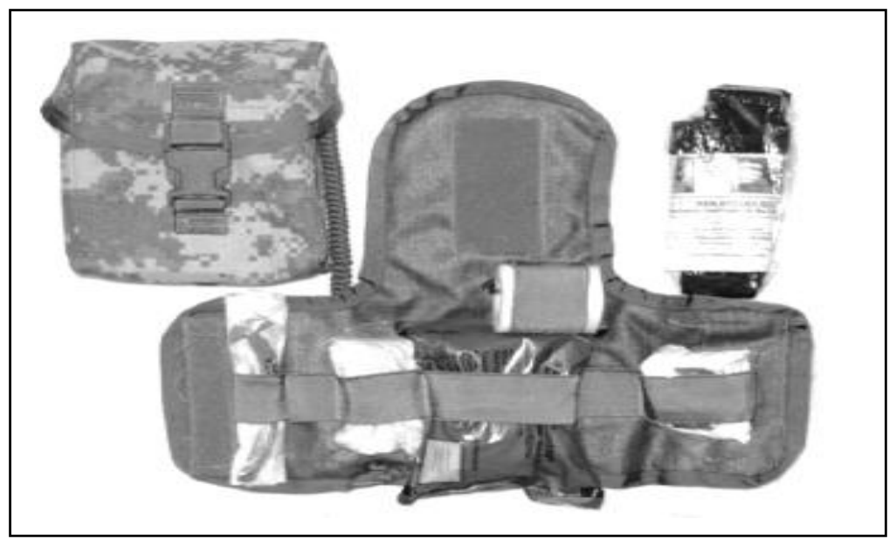
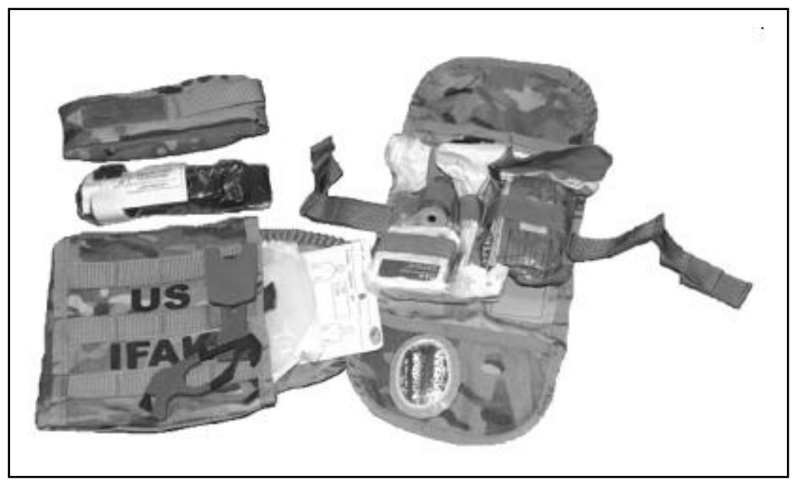

# 附錄 A　急救盒與急救包、核定醫材清單

> **來源**：ATP 4-02.11《陸軍傷患處置、戰術戰傷救護與急救技術準則》，2026 年 3 月 23 日版
> **對應原文**：Appendix A — First Aid Case and Kits, Authorized Medical Allowance List（印刷頁 217–223 / PDF 頁 231–237）
> **譯註**：本譯稿以繁體中文為主體，專有名詞首次出現時附上英文原文與縮寫。**NSN（國家庫存編號）、UAC（單位裝配碼）、零件編號一律保留原文數字，不做任何更動。** 品項名稱譯為中文並在括號內保留原文關鍵字；原文的英制尺寸保留原數值並加註公制換算，實際請領請以原文與 NSN 為準。原文本附錄含表 A-1～A-5（5 張）、圖 A-1／A-2（2 張），圖片已抽出並嵌入（200 dpi PNG）。
>
> ⚠️ **本附錄原文有多處重複段落、重複表列與誤植**（詳見各處譯註與文末〈原文問題彙整〉），**譯文一律照錄，不予刪併或修正**。

---

## A.1　聯合急救包（JFAK）

**A-1.** 本軍種**聯合急救包（joint first aid kit, JFAK）** 包含 **CoTCCC（戰術戰傷救護委員會）** 建議、並經各軍種共同同意的核心組件。下方**表 A-1** 提供 JFAK 現行裝備清單。這些品項適合以 JFAK 名義供任一軍種請領，亦適用於陸軍 IFAK。各軍種以**國家庫存編號（national stock number, NSN）** 維持其個別的 JFAK，內含符合該軍種需求的提袋，並可依軍種需要納入額外品項。**JFAK 符合美國空軍（USAF）的需求**，內容包括：

### 表 A-1　聯合急救包（JFAK）內容物

| 國家庫存編號 NSN | 品項 | 每包數量 |
|---|---|---|
| 6510-01-624-0840 | 排氣式胸封（Vented Chest Seal） | 1 |
| 6510-01-503-2117 | 壓縮紗布（Compressed Gauze） | 2 |
| 6510-01-598-8418 | 紗布繃帶（Bandage, Gauze） | 2 |
| 6515-01-632-0059 | 手套（Gloves） | 2 |
| 6515-01-529-1187 | 鼻咽呼吸道／潤滑膠組合（Nasopharyngeal Airway／Lubricating Jelly Combo）＊ | 1 |
| 6515-01-630-5551 | 護眼罩（Eye Shield） | 2 |
| 5110-01-578-4889 | 安全割勾（Safety Cutting Hook） | 1 |
| 6515-01-521-7976 | 止血帶（Tourniquet） | 2 |
| 零件編號 35124 | 迷你標記筆（Mini marker） | 1 |
| 6510-01-549-0927 | 戰鬥醫務膠帶（Combat Medic Tape） | 1 |
| 6510-01-562-3325 | 止血敷料（Hemostatic Dressing） | 2 |
| 6510-01-587-6579 | 三角巾／三角敷料，無菌（Cravat, Triangular Dressing (Sterile)） | 1 |
| — | DD Form 1380 | 1 |
| 8465-01-633-7981 | JFAK 提袋（JFAK Bag） | 1 |
| 8465-01-633-9717 | 止血帶收納袋（Tourniquet Pouch） | 2 |

> **圖例（Legend）**：
> ・**DD** — 國防部（department of defense）
> ・**JFAK** — 聯合急救包（joint first aid kit）
> ・**pr** — 對（pair）
> ・**＊** — 陸戰隊版 JFAK 不配發此品項。
>
> **譯註（原文圖例錯亂）**：原文圖例中「pr* pair」與註記「Not provided in the Marines JFAK」被排版擠在一起，實際上是**兩件不同的事**——「pr」是「對」的縮寫，而星號（*）是加在「鼻咽呼吸道／潤滑膠組合」上的註腳。此外，**「pr」在表 A-1 中並未實際出現**。譯文依語意拆分呈現，原文照錄。

**A-2.** **國防醫療物資計畫辦公室**正與各聯合軍種協調 **IFAK 轉換為 JFAK** 的作業。**美國海軍是目前唯一使用 JFAK 內胸腔針刺減壓（NDC）品項的軍種。**

---

## A.2　美國陸軍的急救盒與急救包核定醫材清單

**A-3.** A-1 段所述的 JFAK **並不能滿足美國陸軍的全部需求**。美國陸軍已指認出軍種專屬的急救盒與急救包，由**軍種專屬 IFAK** 與 **CLS 背包**構成。

---

## A.3　陸軍個人急救包（IFAK）

**A-4.** **第一代 IFAK（Generation I）** 由**中央發放所（Central Issue Facility）** 配發給每一位官兵，用於施行立即的自救與互救。**每一位官兵都必須受過 IFAK 全部內容物的使用訓練。** 此 IFAK **未包含**用於 NDC（胸腔針刺減壓）的針頭或靜脈留置針。見第 218 頁圖 A-1 與表 A-2。

<figure>
  
  <figcaption>圖 A-1．第一代個人急救包（IFAK Generation I）（原書 p.218） 原文圖說：Figure A-1. Individual First Aid Kit, Generation I</figcaption>
</figure>

### 表 A-2　第一代個人急救包（IFAK Generation I）內容物

| 國家庫存編號 NSN | 品名 | 每包數量 |
|---|---|---|
| 8465-01-531-3647 | MOLLE II 班用自動武器（SAW）100 發彈藥用途袋 | 1 |
| 6515-01-521-7976 | 戰鬥應用止血帶（Combat Application Tourniquet, CAT） | 1 |
| 6510-01-460-0849 | 彈性繃帶組（Bandage Kit, Elastic） | 1 |
| 6510-01-503-2117 | 紗布繃帶，4½ 英寸（約 11.4 公分），100 入 | 1 |
| 6510-00-926-8883 | 外科黏性膠帶，2 英寸（約 5 公分），6 入 | 1 |
| 6515-01-180-0467 | 鼻咽呼吸道（Nasopharyngeal Airway, NPA） | 1 |
| 6515-01-519-9161 | 病患檢查手套，100 入 | 4 |
| 6545-01-586-7691 | IFAK 補給內容物組（Contents Kit, IFAK Resupply） | 1 |
| 6545-01-531-3147 | 內襯（附繫繩的摺疊面板） | 1 |
| 6510-01-562-3325 | 戰鬥紗布敷料（Dressing, Combat Gauze） | 1 |

> **圖例（Legend）**：
> ・**IFAK** — 個人急救包（individual first aid kit）
> ・**IN** — 英寸（inch）
> ・**MOLLE** — 模組化輕量攜行裝具（modular lightweight load-carrying equipment）

**A-5.** 此一 IFAK 包含**兩條戰鬥應用止血帶（CAT）**，收納於附掛在提袋上的收納袋內。**第二代 IFAK** 另含排氣式胸封與護眼罩。第二代 IFAK 與 JFAK 相似，設計者另加入 **2014 年 6 月版 DD Form 1380**、一支永久性標記筆與一把割帶器。該包**重量一磅（約 0.45 公斤）**，內含消耗性醫療品項。見第 219 頁圖 A-2 與表 A-3。

> **譯註（原文自相矛盾）**：本段位於「第一代 IFAK」小節之下，開頭卻寫「**This IFAK** includes two Combat Application TQs（此一 IFAK 含兩條 CAT）」；然而**表 A-2（第一代）僅列 1 條 CAT，表 A-3（第二代）才是 2 條**。依上下文，本段「此一 IFAK」實指**第二代**。譯文照錄原文，不予修正。

<figure>
  
  <figcaption>圖 A-2．第二代個人急救包（IFAK Generation II）（原書 p.219） 原文圖說：Figure A-2. Individual First Aid Kit, Generation II</figcaption>
</figure>

### 表 A-3　第二代個人急救包（IFAK Generation II）內容物

| 國家庫存編號 NSN | 品名 | 每包數量 |
|---|---|---|
| 6545-01-584-1582 | 美國陸軍 IFAK | 1 |
| 6515-01-521-7976 | 戰鬥應用止血帶（Combat Application Tourniquet, CAT） | 2 |
| 6510-01-492-2275 | 彈性繃帶組（Bandage Kit, Elastic） | 1 |
| 6510-01-503-2117 | 紗布繃帶，4½ 英寸（約 11.4 公分），100 支裝 | 1 |
| 6510-00-926-8883 | 外科黏性膠帶，2 英寸（約 5 公分），6 支裝 | 1 |
| 6515-01-180-0467 | 鼻咽呼吸道（NPA） | 1 |
| 6515-01-519-9161 | 病患檢查手套，100 支裝 | 4 |
| 6510-01-562-3325 | 戰鬥紗布敷料（Dressing, Combat Gauze） | 1 |
| 4240-01-570-0319 | 救援割帶器（Strap Cutter, Rescue） | 1 |
| 6510-01-549-0939 | Bolin 胸封（Bolin Chest Seal） | 1 |
| 6515-01-449-1016 | Fox 護眼罩（Eye Shield, Fox） | 1 |
| 7520-00-312-6124 | 管狀標記筆（Marker, Tube Type） | 1 |

> **圖例（Legend）**：
> ・**IFAK** — 個人急救包（individual first aid kit）
> ・**IN** — 英寸（inches）
> ・**s** — 單支裝（singles）
> ・**U.S.** — 美國（United States）

**A-6.** 由於內容持續變動，關於 IFAK、IFAK II 及其內容物的更多資訊與更新，請參閱**美國陸軍醫療物資局（USAMMA）** 網站。

---

## A.4　陸軍戰鬥救生員背包

**A-7.** 美國陸軍 CLS 攜帶一個小型急救背包，亦歸類為**醫療裝備組（medical equipment set, MES）**，內含用於控制出血、解除張力性氣胸及執行其他處置的補給品。**CLS 背包的核定依據為 CTA 8-100**，單位配發基準為**每班、每車組、每小組一個**，由單位指揮官決定。關於 MES 內補給品的現行清單，請參閱陸軍醫療後勤司令部網站的「醫療物資資訊入口（Medical Materiel Information Portal）」頁籤，該頁由美國陸軍醫療物資局管理。**規定裝填清單可在「單位裝配碼（unit assemblage code, UAC）245#」、品名為 MES CLS 之下查得。** UAC 代碼中的「#」是佔位符——最後一個字元會隨裝配清單更新而變動。**本準則出版時，MES CLS 的現行版本為 UAC 245C。** 第 220 頁的**表 A-4** 即為 UAC 245C 的 MES CLS 補給品清單。**清點與裝填 MES CLS 時，應使用最新且現行有效的裝配清單。**

### 表 A-4　美國陸軍戰鬥救生員補給品

| 品名 | 發放單位 | 數量 |
|---|---|---|
| 外科黏性膠帶（Adhesive Tape Surgical） | PG（包） | 1 |
| 鼻咽呼吸道（Airway, Nasopharyngeal） | PG（包） | 2 |
| Atropine 注射劑（阿托品） | EA（個） | 5 |
| 戰傷救護提袋（Bag, Combat Casualty Care） | EA（個） | 1 |
| 彈性繃帶（Bandage, Elastic） | PG（包） | 2 |
| 紗布繃帶（Bandage, Gauze） | RO（卷） | 2 |
| 緊急創傷繃帶（Bandage, Emergency Trauma） | EA（個） | 2 |
| 止血繃帶（Bandage, Hemostatic） | RO（卷） | 2 |
| 三角巾繃帶（Bandage, Triangular Cravat） | EA（個） | 3 |
| 繃帶組（Bandage Kit） | KT（組） | 1 |
| 加熱毯（Blanket, Heating） | PG（包） | 1 |
| 求生毯（Blanket, Survival） | EA（個） | 1 |
| Diazepam 注射劑（安定） | EA（個） | 5 |
| 胸封敷料（Dressing, Chest Seal） | PG（包） | 1 |
| 胸封敷料（Dressing, Chest Seal） | PG（包） | 1 |
| 急救敷料（Dressing, First Aid） | EA（個） | 3 |
| DD Form 1380 | EA（份） | 5 |
| 病患檢查手套 25 對裝（Gloves, Pat Exam 25pr） | PG（包） | 4 |
| 病患檢查手套（Gloves, Patient Exam） | PG（包） | 4 |
| 創傷剪／繫繩剪（Leash Shears, Trauma） | EA（把） | 2 |
| 戰術檢查燈（Light, Tactical Exam） | EA（個） | 1 |
| 實驗室標記筆（Marker, Laboratory） | PG（包） | 1 |
| 減壓針（Needle Decompression） | EA（支） | 2 |
| 異丙醇棉片（Pad, Isopropyl Alcohol） | PG（包） | 1 |
| 繃帶剪（Scissors, Bandage） | EA（把） | 1 |
| 外科護眼罩（Shield Eye, Surgical） | PG（包） | 4 |
| 萬用夾板（Splint, Universal） | EA（個） | 1 |
| 非氣壓式止血帶（Tourniquet, Nonpneumatic） | EA（條） | 2 |

> **圖例（Legend）**：
> ・**DD** — 國防部（department of defense）　・**EA** — 個／件（each）
> ・**KT** — 組（kit）　・**PG** — 包（package）
> ・**pr** — 對（pair）　・**RO** — 卷（roll）
>
> **譯註（原文重複表列）**：表 A-4 中「**胸封敷料（Dressing, Chest Seal）PG 1**」出現**兩列完全相同的資料**；「病患檢查手套」亦以「Gloves, Pat Exam 25pr」與「Gloves, Patient Exam」兩種寫法**分列兩行、數量皆為 4**，疑為同一品項的重複登載。譯文照錄原文列數，不予合併。

---

## A.5　美國陸戰隊的急救盒與急救包核定醫材清單

> **譯註（原文標題重複）**：原文本節標題為「FIRST AID CASE AND KITS, AUTHORIZED MEDICAL ALLOWANCE LIST FOR **FIRST AID CASE AND KITS, AUTHORIZED MEDICAL ALLOWANCE LIST FOR** UNITED STATES MARINE CORPS」，**標題主體被重複貼上一次**。譯文取其正確語意呈現。

**A-8.** A-1 段所述的 JFAK 並不能滿足美國陸戰隊（USMC）的全部需求。陸戰隊已指認出特定的急救盒與急救包，由**軍種專屬 IFAK** 與**軍種專屬 CLS 背包**構成。A-1 段所述的 JFAK 並不能滿足美國陸戰隊的全部需求。陸戰隊已指認出特定的急救盒與急救包，由軍種專屬 IFAK 與軍種專屬 CLS 背包構成

> **譯註（原文段落重複）**：本段在原文中**同一段內把整段內容重複寫了兩次**（第二次結尾甚至漏了句點）。譯文照錄，不予刪併。

---

## A.6　美國陸戰隊個人急救包

**A-9.** 陸戰隊 IFAK 使陸戰隊員與官兵個人具備能力，**對危及生命的動脈出血與常見的非致命傷勢施行自救**，並具備**處理非飲用水以供個人飲用**的能力。

**A-10.** 此 IFAK 由兩部分構成：處理**呼吸道與出血傷勢的創傷組**，以及內含非致命傷勢用品與**飲用水消毒**用品的**配件組**。

**A-11.** 每個 IFAK 都隨附**組件清冊**。對陸戰隊遠征部隊而言，IFAK 的管制、可靠度、戰備、發放與回收，由**支援的個人發放所**負責；未受個人發放所支援的單位，則由**使用單位**自行負責。

**A-12.** **美國陸戰隊個人急救包。** 陸戰隊 IFAK 使陸戰隊員與水兵個人具備能力，對危及生命的動脈出血與常見的非致命傷勢施行自救，並具備處理非飲用水以供個人飲用的能力。

**A-13.** 此 IFAK 由兩部分構成：處理呼吸道與出血傷勢的創傷組，以及內含非致命傷勢用品與飲用水消毒用品的配件組。

**A-14.** 每個 IFAK 都隨附組件清冊。對陸戰隊遠征部隊而言，IFAK 的管制、可靠度、戰備、發放與回收，由支援的個人發放所負責；未受個人發放所支援的單位，則由使用單位自行負責。

> **譯註（原文段落重複與用語不一致）**：**A-12～A-14 三段是 A-9～A-11 三段的重複**，內容幾乎逐字相同。唯一實質差異在第一句的對象——**A-9 寫「Marines and Soldiers（陸戰隊員與官兵）」，A-12 寫「Marines and Sailors（陸戰隊員與水兵）」**。陸戰隊在編制上與海軍配對（醫務兵即為海軍人員），故 **A-12 的「Sailors」較可能正確，A-9 的「Soldiers」疑為誤植**。譯文兩段皆照錄原文用語，不予統一。

---

## A.7　美國陸戰隊戰鬥救生員背包

**A-15.** 美國陸戰隊 CLS 攜帶一個小型急救背包，內含用於控制出血、解除張力性氣胸及執行其他處置的補給品。**表 A-5** 即為 UAC 245C 的 MES CLS 補給品清單。清點與裝填 MES CLS 時，應使用最新且現行有效的裝配清單。

**A-16.** **表 A-5．美國陸戰隊戰鬥救生員補給品。** 美國陸戰隊 CLS 攜帶一個小型急救背包，內含用於控制出血、解除張力性氣胸及執行其他處置的補給品。第 222 頁的**表 A-5** 即為 UAC 245C 的 MES CLS 補給品清單。清點與裝填 MES CLS 時，應使用最新且現行有效的清單。

> **譯註（原文段落重複與可能誤植）**：
> ・**A-16 是 A-15 的重複**，且 A-16 開頭直接把表格標題「Table A-5. Combat lifesaver supplies for the USMC.」寫成了段落正文。
> ・A-15 原文「packing **eh** MES CLS」為「**the**」之誤植。
> ・兩段皆稱表 A-5 為「UAC **245C** 的 MES CLS」，但 **245C 是 A-7 段所述陸軍 MES CLS 的裝配碼**；陸戰隊清單沿用同一組 UAC 疑為複製貼上所致。譯文照錄，不予修正。

### 表 A-5　美國陸戰隊戰鬥救生員補給品

| 品名 | 發放單位 | 數量 |
|---|---|---|
| 酒精棉片 200 片裝（Alcohol Pad 200s） | EA（個） | 8 |
| 紗布繃帶（Bandage, Gauze） | RO（卷） | 8 |
| Bear Claw 手套組 大號 25 對裝 | PR（對） | 3 |
| Benchmade 割帶器（Benchmade Strap Cutter） | EA（把） | 1 |
| 爆震傷敷料（Blast Dressing） | EA（片） | 1 |
| 燒傷敷料，製成 45×45×63 三角巾，已滅菌 | EA（片） | 3 |
| 止血帶（Tourniquet） | EA（條） | 3 |
| 戰鬥護眼罩（Combat Eye Shield） | EA（個） | 2 |
| Combat Gauze XL 止血紗布 4×4 英寸（約 10×10 公分） | EA（片） | 3 |
| 戰鬥救生員提袋（Combat Life Saver Bag） | EA（個） | 1 |
| 戰鬥醫務膠帶 50（Combat Medical Tape 50） | EA（卷） | 1 |
| 國防部 DD Form 1380 | EA（份） | 5 |
| 減壓針 14 號（Decompression Needle 14GA），減壓針 14 號（Decompression Needle 14GA） | EA（支） | 4 |
| Burntec 水凝膠燒傷敷料 4 英寸 × 16 英寸（約 10 × 40 公分） | EA（片） | 2 |
| 胸壁傷口敷料組（Dressing Kit, Chest Wound） | EA（組） | 2 |
| H and H 30FR 鼻咽呼吸道，塑膠材質，30FR，斜切尖端，長 155 公釐，單次使用 | EA（支） | 2 |
| 加壓型緊急創傷敷料 8×10 英寸（約 20×25 公分），平面式 | EA（片） | 3 |
| SAM 夾板（SAM Splint） | EA（個） | 1 |
| Surgilube 潤滑劑包 5 公克 144 包裝 | EA（包） | 2 |
| 創傷剪（Trauma Shears） | EA（把） | 1 |
| 戰鬥救生員創傷背包—狼棕色（Combat Lifesaver Trauma Bag-Coyote） | EA（個） | 1 |

> **圖例（Legend）**：
> ・**EA** — 個／件（each）　・**FR** — French（導管外徑規格）
> ・**GA** — 號（gauge，針號）　・**IN** — 英寸（inch）
> ・**MM** — 公釐（millimeter）　・**pr** — 對（pair）
> ・**S** — 單支裝（singles）　・**SAM** — 可塑形結構鋁材（Structural Aluminum Malleable）
> ・**XL** — 特大號（extra large）
>
> **譯註（原文問題）**：
> ・「減壓針 14GA」在**同一格內被重複寫了兩次**，數量為 4。
> ・「燒傷敷料，製成 **45×45×63** 三角巾」的尺寸**未標示單位**（原文既未寫 IN 也未寫 MM），無從判斷為英寸或公分，譯文照錄數字不做換算。
> ・圖例定義「S＝singles（單支裝）」，但表中實際使用的是「200s」「144s」「25pr」等小寫寫法。

---

## 原文問題彙整（本附錄共 8 處）

| # | 位置 | 原文問題 | 處理 |
|---|---|---|---|
| 1 | 表 A-1 圖例 | 「pr* pair」與註腳「Not provided in the Marines JFAK」排版擠在一起；且「pr」在表中未實際出現 | 依語意拆分，原文照錄 |
| 2 | A-4 | 「Every **Solder** must be trained」——Soldier 之誤植 | 照譯，不標於正文 |
| 3 | A-5 | 位於第一代小節，卻寫「此一 IFAK 含兩條 CAT」，與表 A-2（1 條）矛盾，實指第二代 | 加譯註 |
| 4 | 表 A-4 | 「胸封敷料」重複兩列；「病患檢查手套」以兩種寫法分列兩行 | 加譯註，照錄列數 |
| 5 | A.5 節標題 | 標題主體被重複貼上一次 | 加譯註，取正確語意 |
| 6 | A-8 | 整段內容在同一段內重複兩次 | 加譯註，照錄 |
| 7 | A-9～A-11 / A-12～A-14 | 三段完整重複；且 A-9 寫「Soldiers」、A-12 寫「Sailors」，前者疑為誤植 | 加譯註，兩段皆照錄 |
| 8 | A-15 / A-16 | 兩段重複；A-16 把表格標題寫成正文；A-15 有「eh」（the）誤植；陸戰隊表沿用陸軍 UAC 245C | 加譯註，照錄 |
| 附 | 表 A-5 | 「減壓針 14GA」同格重複兩次；「45×45×63」缺單位 | 加譯註 |

---

## 附錄　本附錄術語對照表

| 英文 / 縮寫 | 繁體中文譯法 | 備註 |
|---|---|---|
| JFAK (joint first aid kit) | 聯合急救包 | 各軍種共通核心組件，符合空軍需求 |
| IFAK (individual first aid kit) | 個人急救包 | 陸軍與陸戰隊各有軍種專屬版本 |
| IFAK Generation I / II | 第一代／第二代 IFAK | 第二代加入胸封、護眼罩、割帶器等 |
| NSN (national stock number) | 國家庫存編號 | **保留原文數字，不做更動** |
| UAC (unit assemblage code) | 單位裝配碼 | MES CLS 現行版本為 UAC 245C |
| MES (medical equipment set) | 醫療裝備組 | CLS 背包的正式分類 |
| CTA 8-100 | （保留原文） | CLS 背包的核定依據 |
| Central Issue Facility | 中央發放所 | 陸軍 IFAK 配發單位 |
| individual issue facility | 個人發放所 | 陸戰隊 IFAK 管制單位 |
| Defense Medical Materiel Program Office | 國防醫療物資計畫辦公室 | 主導 IFAK→JFAK 轉換 |
| USAMMA | 美國陸軍醫療物資局 | 管理醫療物資資訊入口 |
| Medical Materiel Information Portal | 醫療物資資訊入口 | 查詢現行裝填清單 |
| Combat Application Tourniquet (CAT) | 戰鬥應用止血帶 | |
| Tourniquet, Nonpneumatic | 非氣壓式止血帶 | 表 A-4 用語 |
| vented chest seal | 排氣式胸封 | |
| Bolin Chest Seal | Bolin 胸封 | 廠牌名保留原文 |
| occlusive chest seal | 密閉式胸封 | |
| hemostatic dressing / Combat Gauze | 止血敷料／戰鬥紗布 | |
| Blast Dressing | 爆震傷敷料 | |
| Burntec Hydrogel | Burntec 水凝膠 | 燒傷敷料廠牌 |
| NPA (nasopharyngeal airway) | 鼻咽呼吸道 | |
| NDC (needle chest decompression) | 胸腔針刺減壓 | 海軍為唯一自 JFAK 執行 NDC 的軍種 |
| Decompression Needle 14GA | 14 號減壓針 | GA＝gauge，針號 |
| FR (French) | French | 導管外徑規格，保留原文 |
| SAM Splint | SAM 夾板 | SAM＝可塑形結構鋁材 |
| Strap Cutter | 割帶器 | |
| Safety Cutting Hook | 安全割勾 | |
| Trauma Shears | 創傷剪 | |
| Eye Shield, Fox | Fox 護眼罩 | |
| cravat | 三角巾 | |
| MOLLE | 模組化輕量攜行裝具 | |
| SAW (squad automatic weapon) | 班用自動武器 | 其彈藥袋作為第一代 IFAK 外袋 |
| Atropine | 阿托品 | 神經性毒劑解毒劑；**劑量與品名照原文，不換算** |
| Diazepam | 安定（地西泮） | 抗痙攣藥；**照原文** |
| Surgilube | Surgilube 潤滑劑 | 廠牌名保留原文 |
| Coyote | 狼棕色 | 裝備顏色代號 |
| EA / PG / RO / KT / PR | 個（件）／包／卷／組／對 | 發放單位縮寫 |

---

*本附錄譯稿完成，段落 A-1 至 A-16。原文含表 A-1～A-5（5 張，均已完整譯為 Markdown 表格）、圖 A-1／A-2（2 張）。原文重複段落、重複表列與誤植共 8 處，均以譯註標明，未逕行刪併或修正。NSN／UAC／零件編號一律照錄原文；藥品名稱與劑量未做換算，英制尺寸保留原數值並加註公制。*
