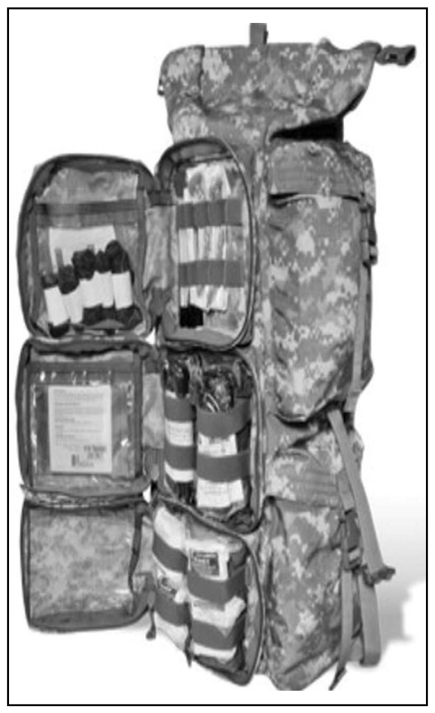
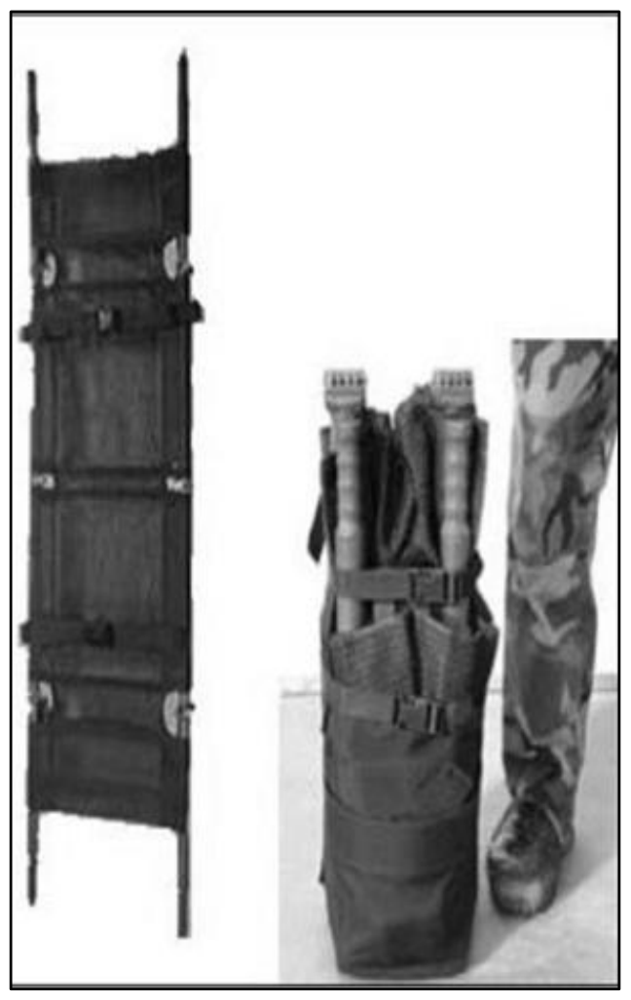
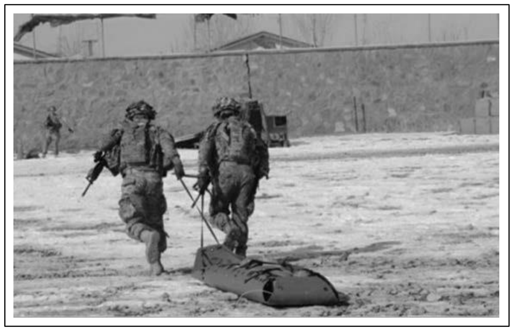

# 附錄 B　救援裝備

> **來源**：ATP 4-02.11《陸軍傷患處置、戰術戰傷救護與急救技術準則》，2026 年 3 月 23 日版
> **對應原文**：Appendix B — Rescue Equipment（印刷頁 224–226 / PDF 頁 238–240）
> **譯註**：本譯稿以繁體中文為主體，專有名詞首次出現時附上英文原文與縮寫。原文長度與重量單位為英制，譯文**保留原數值並於括號內加註公制換算**，實際請領與操作請以原文數值為準。原文本附錄含圖 B-1～B-3（3 張）、無表格，圖片已抽出並嵌入（200 dpi PNG）。

---

## B.1　戰士救護與擔架套件（WALK）

**B-1.** **戰士救護與擔架套件（warrior aid and litter kit, WALK）**（見圖 B-1），可在 CASEVAC 車輛上對**一名患者**施行急救處置與立即後送，並可在**受傷地點（POI）** 處置**多名創傷患者**。WALK 全套總重約 **29 磅 15 盎司（約 13.6 公斤）**。**WALK 可作為車載救命套件的一種選擇。**

<figure>
  
  <figcaption>圖 B-1．戰士救護與擔架套件（WALK）（原書 p.224） 原文圖說：Figure B-1. Warrior aid and litter kit</figcaption>
</figure>

**B-2.** 本系統裝有一副**四折式擔架（quad-fold litter）**（見第 225 頁圖 B-2），以及一組收納醫療補給品的口袋系統。**WALK 內含低體溫預防套件**，以協助在運送途中穩定患者狀況。WALK 另包含下列品項：

- 丁腈創傷手套 **5 對**。
- **28 French** 鼻咽呼吸道（NPA）**2 支**，附潤滑劑。
- 傷患裝備袋 **1 個**。
- CoTCCC 認可的**密閉式胸封 2 片**。
- 戰鬥應用止血帶（CAT）**2 條**。
- 創傷敷料 **6 片**，**6 英寸（約 15 公分）**。
- 捲軸紗布 **4 卷**，**4.5 英寸 × 4.1 碼（約 11.4 公分 × 3.7 公尺）**。
- 腹部緊急創傷敷料 **1 片**。
- 可塑形骨折夾板 **2 個**。
- 創傷剪 **1 把**，**7.25 英寸（約 18.4 公分）**。
- 外科膠帶 **1 卷**，**2 英寸（約 5 公分）**。
- 多用途膠帶 **1 卷**。
- 聚碳酸酯護眼罩 **6 個**。
- TCCC 卡 **2 張**。
- 航空識別布板 **1 面**（辨識用，橙色）。
- 綁縛束帶 **4 條**（萬用擔架用）。

<figure>
  
  <figcaption>圖 B-2．四折式擔架（原書 p.225） 原文圖說：Figure B-2. Quad-fold litter</figcaption>
</figure>

**B-3.** **WALK 可裝入任何制式或非制式的 CASEVAC 載具**，適合作為前進作戰基地（FOB）、傷患集合點（CCP）或巡邏基地上**醫療補給品預置或囤儲**的一部分。

---

## B.2　高分子軟式擔架系統

**B-4.** **CoTCCC 認可的高分子軟式擔架系統（polymer flexible litter system）**（見第 226 頁圖 B-3）採用**雪橇式設計**，讓後送者在後送傷患的同時**仍能持續還擊**。此系統用於**侷限空間、高角度或技術性救援**，在保護傷患的同時，讓救護擔架組**雙手得以空出來操作武器與執行安全維護**。

**B-5.** 本系統配備可供**直升機水平吊掛**、或在洞穴與工業侷限空間中**垂直吊掛**的裝置。**傷患一經包紮固定，擔架即變為剛性。** 收納時可捲起放入背包內（背包隨系統附帶）。此擔架系統重約 **17 磅（約 7.7 公斤）**。

<figure>
  
  <figcaption>圖 B-3．使用高分子軟式擔架系統實施傷患後送（原書 p.226） 原文圖說：Figure B-3. Casualty evacuation using the polymer flexible litter system</figcaption>
</figure>

---

> **譯註（原文版面誤植）**：原文 B-1／B-2 所在頁面的頁尾頁碼印為「**221**」（該頁實為第 **224** 頁），且該頁的頁眉印為「**Introduction**」（應為「Appendix B」）；B-4／B-5 所在頁面的頁眉同樣印為「Introduction」。此為原書排版錯誤，**不影響內容**，譯文依實際章節位置標註頁碼。
>
> 另：B-2 的清單中「One **role** multipurpose tape」為「**roll**（卷）」之誤植，譯文照語意譯為「多用途膠帶 1 卷」。

---

## 附錄　本附錄術語對照表

| 英文 / 縮寫 | 繁體中文譯法 | 備註 |
|---|---|---|
| WALK (warrior aid and litter kit) | 戰士救護與擔架套件 | 全重約 29 磅 15 盎司（約 13.6 公斤） |
| quad-fold litter | 四折式擔架 | WALK 內含 |
| polymer flexible litter system | 高分子軟式擔架系統 | 雪橇式設計，重約 17 磅（約 7.7 公斤） |
| sled design | 雪橇式設計 | 讓後送者可持續還擊 |
| horizontal / vertical hoisting | 水平吊掛／垂直吊掛 | 直升機吊掛／洞穴及侷限空間 |
| confined space | 侷限空間 | |
| high angle rescue | 高角度救援 | |
| technical rescue | 技術性救援 | |
| packaging | 包紮固定 | 傷患固定後擔架轉為剛性 |
| hypothermia prevention kit | 低體溫預防套件 | |
| nitrile trauma gloves | 丁腈創傷手套 | |
| NPA, 28 French | 28 French 鼻咽呼吸道 | French 為導管外徑規格，保留原文 |
| occlusive chest seal | 密閉式胸封 | CoTCCC 認可 |
| CAT (combat application tourniquet) | 戰鬥應用止血帶 | |
| trauma dressing | 創傷敷料 | 6 英寸（約 15 公分） |
| rolled gauze | 捲軸紗布 | 4.5 英寸 × 4.1 碼（約 11.4 公分 × 3.7 公尺） |
| abdominal emergency trauma dressing | 腹部緊急創傷敷料 | |
| moldable fracture splint | 可塑形骨折夾板 | |
| trauma shears | 創傷剪 | 7.25 英寸（約 18.4 公分） |
| polycarbonate eye shield | 聚碳酸酯護眼罩 | |
| TCCC card | TCCC 卡 | 即 DD Form 1380 |
| aviation panel (Recognition, Orange) | 航空識別布板（辨識用，橙色） | 對空識別／標示用 |
| tie-down strap (universal litter) | 綁縛束帶（萬用擔架用） | |
| casualty equipment bag | 傷患裝備袋 | 收納自傷患身上取下的裝備 |
| CASEVAC asset | CASEVAC 載具 | 制式與非制式皆可裝載 WALK |
| forward operating base | 前進作戰基地 | 醫療補給預置地點之一 |
| patrol base | 巡邏基地 | |
| cache | 囤儲 | 預置補給品 |
| aid and litter team | 救護擔架組 | |
| CCP (casualty collection point) | 傷患集合點 | |
| POI (point of injury) | 受傷地點 | |

---

*本附錄譯稿完成，段落 B-1 至 B-5。原文含圖 B-1～B-3（3 張）、無表格。原文版面誤植 2 處（頁碼與頁眉）與用字誤植 1 處（role／roll）已以譯註標明。英制長度與重量保留原數值並加註公制換算；French 導管規格保留原文不換算。*
