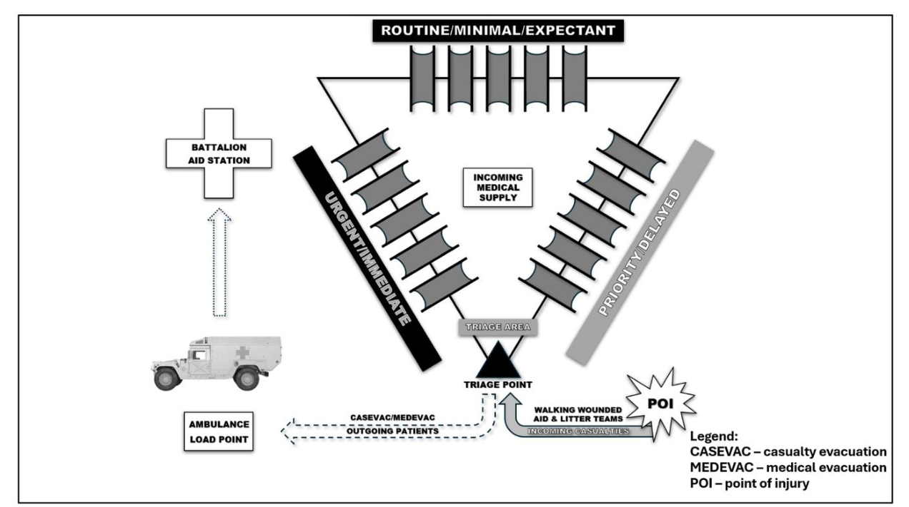
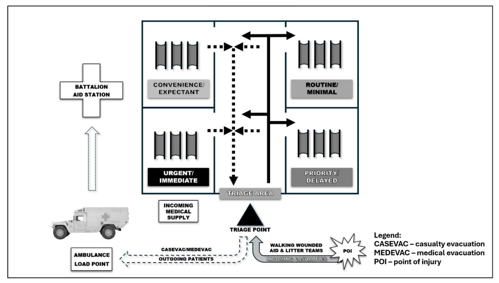
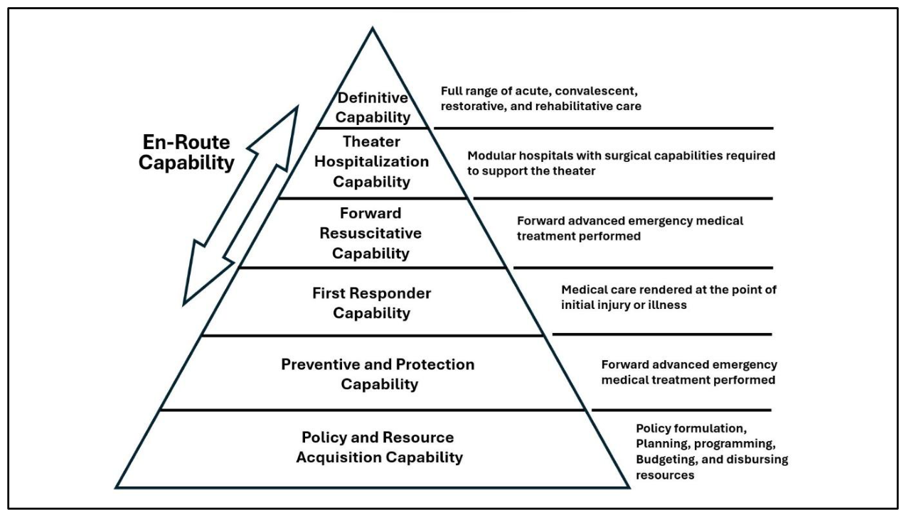
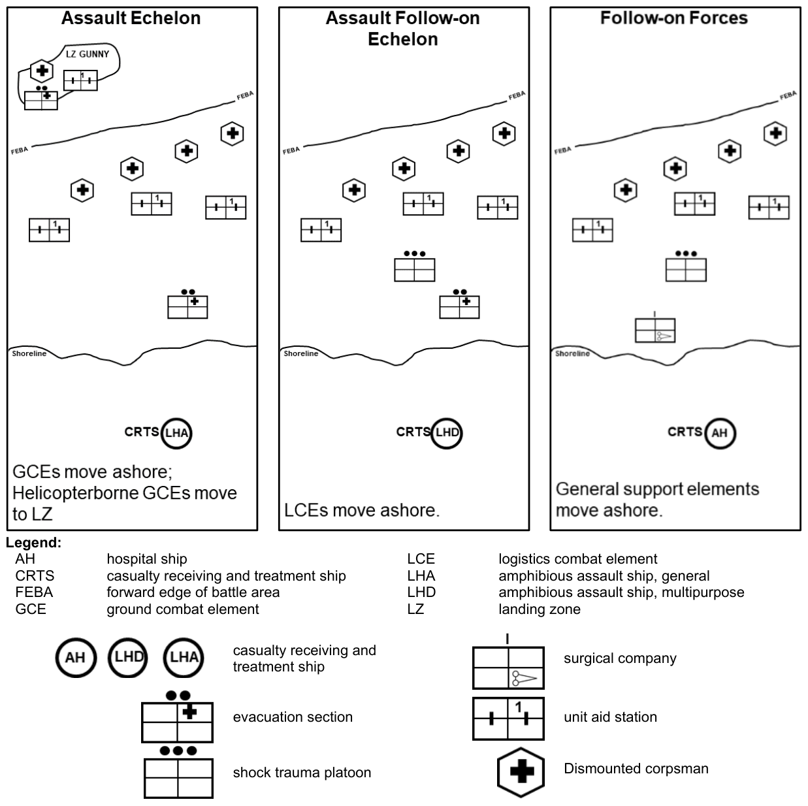

# 第 1 章　傷患處置

> **來源**：ATP 4-02.11《陸軍傷患處置、戰術戰傷救護與急救技術準則》，2026 年 3 月 23 日版
> **對應原文**：Chapter 1 — Casualty Response（印刷頁 1–22 / PDF 頁 15–36）
> **譯註**：本譯稿以繁體中文為主體，專有名詞首次出現時附上英文原文與縮寫。本章為全書開篇，建立傷患處置的**術語體系**（casualty／patient／CCP／CASEVAC／MEDEVAC 等法定定義）與**權責分工**（陸軍排、班、醫務兵、CLS；陸戰隊衛勤體系）。原文加粗處為準則的正式定義句，譯文比照加粗。原文本章含表 1-1（1 張）、圖 1-1～1-4（4 張）、Note 3 則、WARNING 1 則。圖片已抽出並嵌入（200 dpi PNG）。原文距離單位即為公制，未做換算。

---

## PART ONE　傷患處置

> 傷患處置對軍事單位與領導者贏得國家戰爭至關重要，在確保武裝部隊的福祉與效能上扮演關鍵角色。在難以預測、代價高昂的戰爭環境中，傷亡是不幸的現實。無論是戰場上所受的傷勢，或是同袍服役人員的殞落，傷患處置涵蓋了為減輕這些事件衝擊所採取的立即與長期作為。有效的傷患處置不只能挽救性命，還能提振部隊士氣、強化單位凝聚力，使領導者得以維持作戰戰備，並贏得國家的戰爭。

---

## 1.1　傷患處置概論

**1-1.** **傷患處置是對作戰中負傷或陣亡人員所施行的立即而有組織的照護、後送與回報。** 傷患處置是一套**由領導者驅動的體系**，用以同步規劃、預演與執行完成任務所需的個人與團體任務，同時改善傷患的結果。由於國內與戰鬥中軍事行動的性質使然，非醫療的服役人員有時必須仰賴自己與其他服役人員施行急救，直到醫療支援到達。在作戰環境中，**自救、互救與戰鬥救生員（combat lifesaver, CLS）支援通常是傷患所獲得的第一份照護**，並持續提供到受過醫療訓練的人員（戰鬥醫務兵、海軍醫務兵或醫療技術士）抵達並開始處置為止。

**1-2.** **第一線施救者照護包括自救、互救、CLS 任務，以及戰術戰傷救護（Tactical Combat Casualty Care, TCCC）。** 第一線施救者所提供的照護**不限於服役人員**，而是提供給所有需要初期處置、狀況穩定、以及必要時移送至更高照護層級接受進一步處置的人。

**1-3.** 第一線施救者照護因軍種而異，核心訓練聚焦於 TCCC。TCCC 的施行可發生在到院前環境的任何地點，並可由 **JTS（聯合創傷系統，Joint Trauma System）** 調整以支援各軍種的任務需求。TCCC 訓練分為**四個個人層級（tier）或職責範圍**（見第 2 頁表 1-1）：

- 自救或互救。
- 戰鬥救生員（CLS）。
- 戰鬥醫務兵或海軍醫務兵。
- 戰鬥護理師與醫療提供者。

**1-4.** **國防部指令（DODI）1322.24** 規定，全體服役人員與國防部（DOD）遠征文職人員均須接受標準化的戰傷救護訓練。依 DODI 1322.24，全體服役人員都將受訓並精通基本的 TCCC 救命技能。**TCCC 技能取代了舊有的軍事急救技能。** 這套以實證為基礎的戰傷救護途徑，反映了近二十年戰爭的經驗教訓，具有降低到院前可預防創傷死亡的潛力。

### 表 1-1　醫療層級職責

| 層級 | 火力下救護（CUF） | 戰術戰場救護（TFC） |
|---|---|---|
| **全體服役人員**（非醫療人員） | ・確保現場安全。 ・將傷患移至安全處。 ・辨識並控制危及生命的出血。 | ・快速傷患評估。 ・依傷患處置程序施行所有適應的處置。 ・依單位標準作業程序（SOP）指示尋求協助。 |
| **戰鬥救生員 CLS**（非醫療人員） | ・壓制敵方火力，將人員受傷風險降至最低。 ・將先前受傷服役人員的額外傷害降至最低。 ・在可行時協助自救並搬運傷患。 | ・維持安全維護與狀況覺知。 ・執行傷患評估。 ・依傷患處置程序施行所有適應的處置。 ・依指示支援戰鬥醫務兵或海軍醫務兵。 |
| **戰鬥醫務兵或海軍醫務兵**（醫療人員） | ・壓制敵方火力，將人員受傷風險降至最低。 ・將先前受傷服役人員的額外傷害降至最低。 ・在可行時協助自救並搬運傷患。 | ・承擔傷患評估與處置的**主要角色**。 ・管理並指揮傷患處置。 ・運用所有可用施救者建立處置體系。 |
| **戰鬥護理師或醫療提供者**（醫療人員） | ・壓制敵方火力，避免傷患產生新的或額外的傷害。 ・在可行時協助自救並搬運傷患。 | ・擔任單位醫務兵時，提供傷患評估與處置。 ・運用所有可用施救者，管理並指揮傷患處置作為。 |

**戰術後送救護（TACEVAC）階段——戰鬥醫務兵／海軍醫務兵，以及戰鬥護理師／醫療提供者共通職責：**

1. 為後送資源的到達重新評估傷患。
2. 將評估發現傳達給 TACEVAC 醫療人員。
3. 確保適當的待運與裝載支援。
4. 將傷患固定於後送載台上。

**1-5.** JTS 為國防部建立了作戰環境中 TCCC（到院前醫學）的照護標準。JTS 隸屬於**國防衛生局（Defense Health Agency, DHA）**，為各層級的軍事創傷照護提供**臨床實務指引（clinical practice guideline, CPG）** 與績效改善。**CoTCCC（戰術戰傷救護委員會）** 亦支援 JTS，該委員會由陸軍與空軍的代表組成，負責制定作戰環境中施行 TCCC 的 CPG。

> **譯註（原文可能遺漏）**：本段稱 CoTCCC「由陸軍與空軍的代表組成」，然本準則通篇（含 1-3 段的「戰鬥醫務兵或海軍醫務兵」、第 3 章的陸戰隊專節）均以**聯合三軍**架構論述，此處未列海軍與陸戰隊，推測為原文漏列。譯文照錄，不予修正。

---

## 1.2　術語

**1-6.** 徹底理解傷患處置的基本原理，可以挽救性命、預防永久失能，或縮短長期住院。熟悉陸軍與聯合準則所使用的關鍵術語，有助於服役人員更清楚地理解並體認自己在戰術與非戰術環境中提供急救所扮演的角色，也有助於他們明白**在各種情境下何時、以及如何施行急救**。

**1-7.** **「傷亡人員（casualty）」指任何因被宣告死亡、勤務狀態—行蹤不明（DUSTWUN）、核准離營—行蹤不明、失蹤、生病或受傷，而使組織失去戰力的人員（見 JP 4-02）。** 此一「傷亡」分類是在醫療人員處置**之前**賦予服役人員的。受傷後自行施行自救、或由 CLS 給予處置的服役人員，**身分仍是傷患**。該服役人員接著被移至**傷患集合點（casualty collection point, CCP）**，由醫療人員在該處實施檢傷與處置。一旦經醫療人員處置，該服役人員即改列為**患者（patient）**，並進入各層級的醫療照護體系。傷患一旦死亡，即成為**遺體（human remains）**，應與患者流程分離。遺體處理的相關規定不同，詳見 **ATP 4-46**。在提供戰傷傷患的救護、後送與回報時，應遵循各軍種的專屬程序。

**1-8.** **「傷患集合點」是一個可能有人駐守、也可能無人駐守的地點，傷患在此集結，等待後送至有醫療人員的醫療設施（見 ATP 4-02.2）。** CCP 通常沿著前進軸線或後送路線**預先指定**。在 Role 1 **營級救護站（battalion aid station, BAS）** 之前，由戰鬥醫務兵、海軍醫務兵、CLS 與服役人員把傷患送至 CCP。**「營級救護站」是機動營建制中最前方、由醫療人員駐守的處置地點（見 ATP 4-02.4）。** 這些集合點便於支援救護車組收容傷患，並縮短後送時間。當 BAS 運用 CCP 時，CCP 有助於**保持 BAS 的機動性**、避免把傷患往前送，並縮短後送至後勤地區的時間。

**1-9.** **「傷患後送（casualty evacuation）」是搭乘任何載具、不受管制的傷患移動，亦稱 CASEVAC（見 JP 4-02）。** 陸軍將傷患後送定義為**以非醫療車輛或航空器移動傷患，且途中無醫療照護**（見 ATP 4-02.13）。若傷患以非醫療車輛送往**醫療設施（medical treatment facility, MTF）**，且途中沒有受過醫療訓練的服役人員（例如戰鬥醫務兵或海軍醫務兵）提供照護，則**在運送途中應持續施行 TCCC**。以此方式運送的傷患通常不會獲得途中醫療照護。若傷患被具有受訓醫療人員編組的專用醫療載具接收，**急救的角色即告終止**，該傷患轉由軍事衛生體系（Military Health System）鏈路負責，並自此稱為患者。

**1-10.** 傷患處置的核心原則包括：**自救或互救（第一線施救者照護）**、**醫療處置**（由戰鬥醫務兵、海軍醫務兵或醫療技術士提供），以及**領導者職責**（例如安全維護、現場管制、設立 CCP、監控人員、管理傷患搬運、履行回報要求、協調後送）。這些原則必須經過充分預演與執行，才能在任何作戰環境中把存活率最大化。原則本身雖然恆定，**實際適用的具體條件卻可能差異極大**，且同時適用於軍事行動與民間事故應變。這種調適性確保應變策略在不同情境下都有效，並提升緊急管理的整體效能。

**1-11.** **JP 4-02 將「戰鬥救生員」定義為：受過額外創傷訓練並配發裝備、能提供超出自救或互救之強化醫療處置的國防部非醫療人員（見 JP 4-02）。** 美國陸軍則將戰鬥救生員定義為：**受過訓練並配發裝備、以提供強化急救為次要任務的官兵**，簡稱 CLS。**「強化急救」是指需要比自救與互救更高一級訓練才能施行的措施。** CLS 提供此一層級的強化急救，並處置戰場上最常見的死因——**大量出血、呼吸道與／或呼吸問題**。CLS 也學習預防併發症、以及處置其他相關但非危及生命傷勢的技能。**每一個班、車組、小組或同等規模單位，至少應有一人受訓。** 該人員的主要職務不變；其擔任 CLS 的**附加職務**，是在戰鬥醫務兵或海軍醫務兵到達之前，依其所受訓練對傷勢提供強化急救。

**1-12.** **「急救（first aid）」是對傷患或軍用工作犬（軍用動物）所施行的立即救命措施。** 每一位服役人員都受訓精通對受傷人員施行的各項特定急救程序。此一訓練使服役人員本人或同袍得以施行立即急救措施，以緩解受傷者危及生命的狀況。**經遴選的官兵另受訓對軍用工作動物施行急救**；關於軍用工作動物急救的補充資訊，參閱 Deployed Medicine 網站。

**1-13.** **「第一線施救者（first responder）」是任何對自己或他人提供初期與立即處置的人（見 JP 4-02）。** 第一線施救者在傷患處置中扮演關鍵角色：提供包括出血控制與呼吸道處置在內的立即救護，提高作戰環境中傷者的存活機會。

**1-14.** **「醫療後送（medical evacuation）」是以專用且標示明確的醫療載台，將負傷、受傷或患病者及時而有效地送往醫療設施、或在醫療設施之間移動，途中由醫療人員提供照護，亦稱 MEDEVAC（見 ATP 4-02.2）。**

**1-15.** **「醫療設施（medical treatment facility）」是為使符合資格者獲得醫療與／或牙科照護而設立的設施，亦稱 MTF（見 JP 4-02）。** 陸軍則將醫療設施定義為**任何為提供醫療處置而設立的設施**（見 FM 4-02），包括營級救護站、Role 2 設施、醫務所、診所與醫院。

**1-16.** **「醫療處置（medical treatment）」是由受過醫療訓練、具證照或具資格認定的人員，對負傷、受傷或患病服役人員所施行的照護與管理。** 可能包括**緊急醫療處置（emergency medical treatment, EMT）**、進階創傷處置，以及復甦與外科介入。

**1-17.** **聯合軍種將「患者（patient）」定義為：接受醫療照護、牙科照護或其他醫療處置的患病、受傷、負傷或其他人員（見 JP 4-02）。** 美國陸軍則將患者定義為**接受受訓醫療人員照護或處置的負傷、患病與受傷官兵**（見 ATP 4-02.10）。傷患一旦進入醫療照護連續體（戰鬥醫務兵、海軍醫務兵、後送機組或 MTF），**急救在該傷患照護中的角色即告終止**，該傷患轉由軍事衛生體系負責。傷患進入軍事衛生體系後，即稱為患者。

**1-18.** **「戰術戰傷救護」是在戰鬥中處置傷患時，對戰術與醫學所做的審慎整合，亦稱 TCCC（見 JP 4-02）。** 單位的**標準作業程序（SOP）** 與作戰命令，應詳細規範 TCCC 程序與**傷患後送（CASEVAC）**，包括對化學傷患的救護，並特別著重救命任務。SOP 應涵蓋關鍵人員的職掌與責任、**CBRN（化學、生物、放射與核）污染傷患的後送**（其路線須與未受污染傷患分開），以及操作關鍵武器與陣地的優先順序。SOP 應載明**主要與備用的後送方式**，並就傷患的武器、彈藥與裝備的取回與保管做出規定。輕傷人員應在適當的照護層級接受處置，並儘速歸建。**CASEVAC 與醫療後送（MEDEVAC）應比照作戰的其他關鍵環節加以預演。**

**1-19.** **「檢傷分類（triage）」是依據戰術情況、任務與可用資源，對傷患進行分流與排定優先順序的體系（見 FM 4-02）。** 傷患在被送往處置區之前，會先被分流並歸入處置類別之一：**立即（immediate, I）、延遲（delayed, D）、輕微（minimal, M）、期待（expectant, E）**。此一分流在**檢傷點**進行，稱為「**IDME**」或「**DIME**」。關於傷患檢傷分類的補充資訊，見第 38 頁 3-87 段。

---

## 1.3　傷患集合點作業

**1-20.** 指定 CCP 時，**單位指揮官須決定是否派醫療人員進駐 CCP**，此決定依風險評估與人力可用性而定。醫療人員未必有餘裕駐守這些集合點，因此 CLS 與可行動的患者可能必須自行執行自救、互救或 CLS 支援。CCP 應標示於**船艦、作戰要圖上**，並依作戰階段規劃。CCP 的規劃考量包括：**位置安全維護、與起降場（landing zone, LZ）的距離、掩蔽與隱蔽，以及後送路線的可及性**。領導者應就救護擔架組、傷患裝備的分配，以及如何妥善避開隘道等事項提供指導。**CCP 內部的活動由醫療人員負責，CCP 外部的活動由受支援單位的領導者負責。**

**1-21.** 單位必須**縝密規劃傷患自受傷地點（point of injury, POI）到支援之 Role 3 MTF 的移動**。醫療幕僚與單位領導者都必須充分掌握傷患流向，**理解範圍至少要向上延伸兩個層級**，涵蓋醫療調節（medical regulating）、傷患追蹤與住院規範等知識。舉例而言，排長與其醫務兵應清楚知道傷患離開連 CCP 與 BAS 之後所走的路徑；同樣地，連級領導者與資深醫務兵應熟悉傷患在 BAS 之後、通過 Role 2 MTF 的行進軌跡。

**1-22.** 此外，**必須考量指定的 Role 3 MTF 可能發生變動**——例如跨越階段線時，或某設施已達收容上限時。醫療人員必須隨時掌握這些變數，並定期更新自身對現況的認知。如此才能確保傷患照護與後送鏈保持效率，並能因應動態的作戰條件。

**1-23.** 領導者必須能回答下列問題，才能建立戰術傷患流：

1. 傷患要被後送到哪裡？
2. 由地面、空中還是水上載具執行至 CCP 的後送？
3. 至 CCP 的後送要如何執行？
4. 距離與行進時間各是多少？
5. 預期的傷患撐得到那麼遠嗎？若撐不到，計畫的哪些部分需要修正？
6. 由誰執行傷患後送（CASEVAC 或 MEDEVAC）？
7. 醫療資源的配置是否足以確保照護的連續性？

---

## 1.4　位置選擇

**1-24.** CCP 的配置（見第 6 頁圖 1-1）位置，在**軍事決策程序（MDMP）或部隊領導程序（troop leading procedures, TLP）** 的規劃階段就要處理。戰術戰鬥計畫會依納入計畫的單位類型與數量而有所不同。**任務變數在作戰期間始終是 CCP 位置選擇的考量因素。**

<figure>
  
  <figcaption>圖 1-1．開闊地或野地的傷患集合點配置（原書 p.6） 原文圖說：Figure 1-1. Casualty collection point layout in an open area or field</figcaption>
</figure>

**1-25.** CCP 的位置取決於**單位位置、戰術情況，以及待後送的傷患數量**。連 CCP 的位置由連士官長決定，排 CCP 則由排士官長決定，兩者均參考所屬戰鬥醫務兵的建議。**傷患如何自 POI 移至 CCP，應以戰鬥操演與戰術 SOP 明訂。**

**1-26.** 連 CCP 應設於連戰鬥支援梯隊地區內**有掩蔽與隱蔽的位置**，排 CCP 則應設於排的後方。CCP 應具備下列條件：

- 遠離天然或敵設的隘道。
- 有掩蔽與隱蔽。
- 傷患量增加時可擴充。
- 位於建物內或硬鋪面上（**專用的 CCP 建物可減少混亂**）。
- 位於排水良好的區域。
- 位於警戒圈內，並容許被動式安全維護。
- 靠近**患者漂移路線（lines of patient drift）**——即傷者可能自戰鬥位置後返尋求醫療照護的天然路徑。
- 靠近後送路線（徒步、車輛、航空器）並可通達。
- 靠近推估的高傷亡預期區域。
- 緊鄰目標區隘道。
- 與戰鬥距離適中。
- 後送載具可通行。

> **註**：「**漂移路線（Lines of Drift）**」是指在考量障礙與通往目標的行進方式後，阻力最小、行進最容易的路徑。

**1-27.** 在都市地區作戰時，**於建物內設立 CCP**（見第 7 頁圖 1-2）可能是唯一選擇。在單位確認建物已肅清並確保安全後，領導者應——

1. 在收容傷患之前，判定結構、環境、醫療與 CBRN 危害。
2. 決定管制點與檢傷點的位置。
3. 將壅塞降至最低。
4. 移除或搬遷家具與障礙物。
5. 考慮採用硬式擔架或無桿的軟式擔架以利搬運。
6. 儘可能使用最大的房間。
7. **依處置類別分房安置**；若檢傷類別被牆面隔開，監看所有傷患的難度會提高。
8. 以顏色編碼並依處置類別標示房間。

<figure>
  
  <figcaption>圖 1-2．建物內的傷患集合點（原書 p.7） 原文圖說：Figure 1-2. Casualty collection point in a building</figcaption>
</figure>

---

## 1.5　傷患集合點的位置選擇

**1-28.** CCP 的位置選擇在部隊領導程序中處理，且 **CCP 的 SOP 應經過預演**。CCP 設立時應具備：

- 日間與夜間的標示系統。
- **檢傷點**，作為進出 CCP 的關卡，以追蹤傷患並管制進出。
- 適用於日夜（非戰術或戰術）作業的**後送類別標示**。
- **陣亡（killed in action, KIA）區**，須與其他傷患分開。
- 醫療補給區。
- **直升機起降場（HLZ）**。

**1-29.** 連士官長或排士官長負責傷患流以及 CCP 外部的一切事務。他們必須——

1. 提供 CCP 的架構與編組（依戰術 SOP 以顏色編碼，日夜皆適用）。
2. 維持指揮管制與狀況覺知。
3. 管制救護擔架組。
4. 確保安全維護已建立並持續。
5. 在處置區之外移除、收集、識別、整理並保管傷患裝備。
6. 追蹤傷患與裝備進出 CCP 的情形。
7. 建立帳務並向上級呈報。
8. 引導傷患通過 CCP 的進出管制點。

**1-30.** **CCP 內部的作業由醫療人員負責。** 派駐 CCP 的醫療人員包括：

- **檢傷官或檢傷士官**：負責將傷患分流並歸入適當的處置類別。
- **醫務兵、海軍醫務兵或醫療技術士**：負責整理醫療裝備與補給品。
- **醫療人員、CLS 與救護擔架組**：協助處置與傷患的包紮固定（packaging）。

**1-31.** 檢傷後被歸為「**輕微**」的傷患，理想上應留在其編制單位，或在可能時協助 CCP 的安全維護。死亡人員列為 **KIA（陣亡）**，其遺體應留在編制單位，直到遺體事務人員抵達、或遺體轉送至殮房為止。**遺體事務 SOP 應清楚規範遺體的處理方式**，並考量戰區的特定要求、環境因素，以及該服役人員的宗教信仰。

**1-32.** 另須注意，**死亡人員的遺體不應與患者同乘 MEDEVAC 救護載具**。此做法有助於維護亡者的尊嚴，並確保 MEDEVAC 期間的焦點仍放在為存活的傷患提供緊急照護。

---

## 1.6　美國陸軍單位的傷患處置

**1-33.** 對一個組織而言，傷患的處置與後送是艱難的任務，因為其作戰位置往往遠離上級司令部。**單位應配賦足夠的資源給排級**，以協助傷患的處置與後送。排醫務兵負責評估與處置患病及受傷的官兵，並協助單位執行傷患後送。

---

## 1.7　傷患照護（陸軍）

**1-34.** 傷亡發生時，**排必須對作戰負傷者提供救護**。戰鬥醫務兵在非醫療人員的協助下，提供 **EMT（緊急醫療處置）** 以緩解可能危及生命的傷勢，確保最大存活率。此一支援通常由士兵階層人員提供，包括急救（自救或互救）、CLS 的強化急救，以及排醫務兵的 EMT。

### 1.7.1　作戰負傷（Wounded in Action）

**1-35.** 同袍能否對受傷戰友提供救護，**深受戰術情況影響**。當官兵集中力量擊敗或壓制造成傷害的敵人時，才更有可能把傷亡降到最低。

**1-36.** 戰鬥期間，**必須把傷患移至有掩蔽與隱蔽的位置**，才能安全施行急救。立即威脅一旦消退，班長應協調把傷者後送至排 CCP（通常位於排陣地後方）。在 CCP，排醫務兵會執行檢傷、穩定傷者狀況，並啟動將其轉送至更完整醫療設施的程序。關於 CCP 的詳細作業，見第 4 頁 1-20 段。

**1-37.** 在把傷患後送至 CCP 或更後方之前，領導者必須確保：

1. 傷患的**個人防護裝備**（例如防護面具）隨其一同移動。
2. 所有重要的作戰用品、敏感物品與裝備均已自傷患身上取下。
3. **醫療紀錄與識別牌**已牢固地繫在每一位傷患身上，以簡化醫療處置與追蹤流程。

**1-38.** 此外，應取下的裝備還包括**自動網路管制裝置、全球定位系統、地圖、定位裝置與雷射指示器**。每個單位都應訂有 SOP，管理其傷者的武器與彈藥，確保這些措施能有系統地落實，並符合安全與作戰安全標準。

### 1.7.2　陣亡（Killed in Action）

**1-39.** **排長負責指定 KIA 的集中地點。** 個人遺物須留在遺體旁。班長在以尊嚴與敬意對待遺體的同時，取下並保管所有裝備與公發物品，直到能移交排士官長為止。排士官長再將遺體移交連士官長。**排不應以載運傷者的同一輛車運送遺體。** 遺體通常以空的補給卡車運往後方，但實際做法依單位 SOP 而定。

**1-40.** 指揮官與連士官長應建立指揮程序，確保依 **ATP 4-46/MCRP 3-40G.3/NTTP 4-06/AFTTP 3-2.51** 妥善通知官兵的**最近親屬（next of kin）**。陣亡與傷亡作業存在**非官方通訊外洩的風險**：在作戰地區附近使用手機與電腦，使許多官兵得以就傷亡事件聯繫其駐地。**這類通訊屬非官方性質，且不可接受。** 作戰負傷或陣亡官兵的最近親屬，不應透過非官方管道獲知消息。因此，**在傷亡通知官正式通知最近親屬之前，作戰地區附近的手機與電腦使用應實施通訊管制（communication blackout）**，管制期間不得使用網際網路或撥打電話回家。

---

## 1.8　後送考量

**1-41.** 執行 CASEVAC 是單位的基本職責，也是後勤作業的關鍵環節。為有效執行 CASEVAC，單位領導者應考量下列各點以優化其規劃與應變：

1. **掌握後送載台**：
   - 判定機（車）上是否有醫療提供者。
   - 查核是否備有必要的監測儀器。
   - 確認該載台可後送多少名**可行動傷患與擔架傷患**。
2. **理解載台規格**：
   - **大型載台**：可後送多名傷患，**先裝載常規（routine）個案，其次是優先（priority），危急（緊急，urgent）個案最後裝載**，以確保其在目的地最先卸下。
   - **小型載台**：**優先後送危急（緊急）與優先個案**，常規個案則視空間餘裕後送。
   - 確認所有固定裝置功能正常，且與所使用的擔架型式及後送載台相容。
3. **後送載台的包紮固定需求**：
   - 確認可用的擔架型式。
   - 判定該擔架屬**有腳蹬式（stirrup-based）** 或**無腳蹬的無桿式**，以及是否與後送載台相容。
   - 確保有足夠裝備可預防低體溫，讓傷患保持溫暖與乾燥。
4. **固定傷患並決定在後送載台上的裝載順序**：
   - 落實把擔架綁縛或固定於載具上的程序，確保運送過程的安全。
   - 確立清楚且已排定優先序的裝載順序，以簡化後送流程。
   - 有效率地規劃並協調傷患移至後送載台的動線。

**1-42.** 藉由處理上述各領域，並強化「領導者親自主導 CASEVAC」與「確保所有擔架都已綁牢」等作為，領導者能提升後送作業的效率與安全，最終在關鍵情境中改善傷患照護。

### 1.8.1　醫療後送

**1-43.** MEDEVAC 可由**專用的空中或地面救護載具**執行。MEDEVAC 包含**途中醫療照護**的提供，而 CASEVAC 在移動過程中則未必提供醫療照護。關於 MEDEVAC 的更多資訊，參閱 **ATP 4-02.2**。**若有專用的 MEDEVAC 載台（地面與空中）可用，傷患即應以這些載具後送**，以確保獲得妥適的途中醫療照護。若 MEDEVAC 與 CASEVAC 併用，**傷勢最重者應以 MEDEVAC 載台後送**，傷勢較輕者則以 CASEVAC 移動。

**1-44.** 在可能的情況下，醫療排的救護車負責自 POI 或排／連 CCP 至 BAS 的後送與途中照護。支援連的救護車組與支援各排的資深戰鬥醫務兵協同作業。在**大量傷患情境**中，可依連長或領導者指示，動用非醫療車輛協助 CASEVAC。不過，**運用非醫療車輛執行 CASEVAC 的計畫應納入單位 SOP**，並在後勤與聯兵預演中提報。

**1-45.** 在大規模戰鬥行動中，**地面 MEDEVAC 是主要的後送手段**，原因是作戰環境使然，且地面救護車數量較多。**空中醫療後送則是較受偏好的方式**，因為空中救護載具速度更快、航程更遠。執行空中醫療後送前應考量任務變數。選擇 LZ 位置時，該起降場應**相對平坦、且無電線等危害**；鬆散雜物應予清除，以免被吸入引擎或因旋翼下洗氣流造成傷害。**排負責 LZ 的局部安全維護，直到後送完成為止。**

**1-46.** **由現場最資深的軍職人員決定是否申請後送。** 申請 MEDEVAC 的決定，依現場最資深醫療人員的建議、患者狀況、戰術情況，以及是否有專用醫療載台可用而定。在可用資源與待執行任務允許的前提下，傷患應儘速被接運。後送優先順序的類別與其判定準則如下：

- **Priority I — 緊急（Urgent）**：適用於須**儘速、且最遲在一小時內**後送的緊急個案，以保全生命、肢體或視力；預防重症併發症；或避免永久失能。
- **Priority IA — 緊急外科（Urgent Surgical）**：適用於須**儘速、且最遲在一小時內**後送的患者，這類患者必須接受**高度前推的外科介入**以保全生命、肢體或視力，並穩定狀況以利後續後送。
- **Priority II — 優先（Priority）**：適用於需要迅速醫療照護的患病與負傷人員。適用時機為：該員應在**四小時內**後送；或其醫療狀況可能惡化到轉為「緊急」；或其所需的特殊處置在當地無法取得；或該員將承受不必要的疼痛或失能。
- **Priority III — 常規（Routine）**：適用於需要後送、但狀況預期不會顯著惡化的患病與負傷人員。此類人員應在 **24 小時內**後送。
- **Priority IV — 便利（Convenience）**：適用於以醫療載具後送屬於**醫療上的便利而非必要**的患者。

> **註**：北大西洋公約組織（NATO）標準化協定（STANAG）3204 已**刪除 Priority IV — 便利**此一類別。惟作戰環境中確有此需求，故**美國陸軍的後送優先順序仍保留此類別**。

### 1.8.2　醫療後送申請

**1-47.** 遭受攻擊後，一旦得知排內出現傷患，**車長、班長或組長、排士官長即應著手準備後送申請**。地面與空中的後送申請**格式並無不同**。單位依 **FM 6-99** 向指揮所傳送**九線 MEDEVAC 申請（報告編號 M030）**。單位使用**圖形訓練輔助教材 GTA 08-01-004（MEDEVAC 申請卡）** 取得美軍正確的回報線號與簡語代碼，並以此報告申請後送患病與負傷人員。此報告與 **STANAG 2020 及 STANAG 2627** 規範的 NATO MEDEVAC 申請（九線 MEDEVAC）類似；**NATO 版九線 MEDEVAC 申請僅在命令程序中特別指示時才使用**。

**1-48.** 除標準的九線 MEDEVAC 申請格式外，更高照護層級可能還要求一份 **MIST 報告**（傷害機轉 Mechanism of injury、傷勢類型 Injury type、徵象與症狀 Signs and symptoms、處置 Treatments），應由現場的排醫務兵或 CLS 提供。**國防部（DD）Form 1380（戰術戰傷救護 TCCC 卡）填寫完成後，即為 MIST 報告。** 關於 MEDEVAC 申請流程的更多資訊，見第 34 頁 3-62 段，或參閱 **ATP 4-02.2**。

**1-49.** 對於位於 MEDEVAC 支援範圍之外、或 MEDEVAC 資源無法動用的傷患，會運用各種**多模式患者運送（multimodal patient movement, MMPM）** 或 CASEVAC 資源執行後送任務，其中 **MMPM 是較受偏好的後送方式**。

### 1.8.3　傷患後送

**1-50.** 服役人員可能必須執行或協助傷患的脫困、救援與後送。可用的**脫困器材、戰術情境、環境狀況與操作手法**眾多，以完成適切的傷患移動。關於傷患搬運的詳細資訊，參閱 **ATP 4-02.13**。

> ### ⚠️ 警告（WARNING）
>
> 以此方式運送的傷患，**可能無法獲得妥適的途中醫療照護**，也可能未被送往能處理其醫療狀況的適當 MTF。
>
> 若傷患的醫療狀況在運送途中惡化，或傷患未被送往適當的 MTF，**可能對其預後造成不利影響，導致長期失能或死亡**。

**1-51.** 當 MEDEVAC 資源有限時，**運送傷勢較輕的傷患是單位的責任**（即 CASEVAC）。CASEVAC 的規劃須與既有的醫療支援計畫同步，以確保流程順暢，這包括**事前的編組、準備、協調與演練**。該計畫應確保受過急救訓練的小組熟練於操作擔架、在醫療據點周邊作業，並能正確判定檢傷類別。**只要可能，用於運送傷患的非醫療車輛、航空器與船艇，都應有 CLS 或醫療人員隨行**，以在運送途中提供必要照護。

**1-52.** 空間可能不足以讓照護者隨行或評估傷患。更多資訊參閱 **ATP 4-02.13**。途中監測與醫療照護（或急救）的類型，受下列因素限制：

- **提供照護者的技能層級**：戰鬥醫務兵有資格提供 EMT，而 CLS 受訓提供的是強化急救。**戰鬥醫務兵能施行緊急醫療介入，CLS 則只能監測傷患並確保基本救命急救任務完成。**
- **可用的醫療裝備。**
- **運送中的傷患數量。**
- **傷患的可及性**：若非制式後送車輛已裝載至最大傷患數，戰鬥醫務兵或 CLS 可能無法在車輛行進中照護傷患。若某傷患狀況惡化而需要緊急措施，**可能必須停車**，讓戰鬥醫務兵或 CLS 提供額外照護。

---

## 1.9　多模式患者運送

**1-53.** 當醫療人員在**非醫療載台**上運送傷患的過程中提供照護時，即稱為 **MMPM（多模式患者運送）**。MMPM 是指依 **JP 4-02** 所述，運用可用的運輸方式有效率地移動傷患並提供途中照護。MMPM 載台可包括**海上、陸上或空中載具**，並可作為照護設施之間的主要或次要運送方式。不過，運用這類載台意味著**必須接受患者與運送團隊因其交戰人員身分而升高的風險**。為確保患者移動安全，MMPM 載台可能配備**標準化醫療套件**，這凸顯了縝密規劃與準備的重要性。

---

## 1.10　單位回報

**1-54.** **傷亡報告（casualty report）在傷亡發生時、或戰術情況一允許時即應填寫**，通常由該官兵的班長完成，交給排士官長，再由排士官長轉呈連士官長。報告內容應包括**傷亡如何發生的簡要敘述**（含地點、時間與當時執行的活動），以及**由誰或何物造成該傷勢**。若班長並未親身知悉傷亡發生經過，則應向知情的官兵取得這些資訊。關於人力資源對傷亡作業之支援的進一步討論，參閱 **ATP 1-0.1**。

**1-55.** 傷亡一旦發生，**最近的目擊者通報排士官長**，排士官長再以最快捷的方式（例如任務指揮系統中的自由文字訊息或無線電語音）通報連士官長。連士官長向**營 S-1（人事）科**提交**人員狀況報告**，記錄所有傷亡人員的勤務狀態異動。傷患則被送往 CCP，進行傷勢類型分類（緊急、優先、常規或歸建）、後送，並納入醫療處置體系。

### 1.10.1　醫療與人事帳務

**1-56.** 官兵成為傷患時，**排戰鬥醫務兵或資深戰鬥醫務兵應把該員所接受的醫療處置記錄於 DD Form 1380**。BAS 與 Role 2 在處置該員時會讀取其 DD Form 1380。營 S-1 應以電子方式收到通知訊息，以更新該員的患者追蹤狀態；該訊息再轉發至該員所屬連。如此一來，**傷患的位置便可確定，該官兵也能被所屬單位妥適地列入帳務**。

### 1.10.2　人事報告

**1-57.** 單位運用**人事報告**向指揮群通報傷亡情形，並據以提出人員補充申請。**補充申請通常在傷亡報告之後立即提出。** 這種系統化做法確保指揮群充分掌握人員狀況，並能迅速回應增援需求以維持作戰效能。**這些細節的即時通報，對戰略規劃與快速因應戰場變化至關重要。**

### 1.10.3　人員戰損報告

**1-58.** 傷亡發生時，單位依 **FM 6-99** 向指揮所傳送**傷亡報告（CASREP，報告編號 C001）**，亦稱**人員戰損報告（personnel battle loss report）**。此報告與 **STANAG 2020** 規範的 NATO 傷亡通知（第 1 階段，NOTICAS1）類似。單位須填具 **DA Form 1156（傷亡通報卡，Casualty Feeder Card）** 並附上目擊者陳述，將整份文件呈交連士官長。**人員戰損報告屬過渡性報告**，用以更新上一份人員每日概況報告所送出的資訊。

**1-59.** DA Form 1156 用於回報**已陣亡並尋獲、或已負傷**的官兵，也用於回報**陣亡、失蹤、被俘或未尋獲**的官兵。**目擊者陳述應由對該事件最了解的官兵填寫。** 此資訊用於通知該員的最近親屬，並提供分析我方或敵方戰術的統計基礎。關於陸軍傷亡計畫的更多資訊，參閱**陸軍規則（AR）638-8**。

**1-60.** 傷患的醫療狀況一旦穩定，**連長可撰寫信函給該官兵的最近親屬**。戰鬥間隙時，排把傷亡資訊上報連部。連士官長確保填妥的 DA Form 1156 轉呈營 S-1，再由 S-1 將資料鍵入**國防傷亡資訊處理系統（Defense Casualty Information Processing System）**。

---

## 1.11　傷患處置預演

**1-61.** 在部隊領導程序中，組織應**依單位 SOP 預演 CCP 計畫**。單位領導者與計畫人員應**把醫療排的領導者納入軍事決策程序、命令產製與 CCP 預演之中**，以確保後送計畫與單位任務相互支援，並使醫療的**戰術、技術與程序（TTP）** 為各方所理解。實施傷患處置預演時，應著重的項目包括：

1. **通知救護擔架組**，並執行：
   - 通知與移動。
   - 後送裝備準備。
   - 武器的清膛與保管。
2. **CCP 成員**執行：
   - 肅清並確保 CCP 位置的安全。
   - 檢傷點作業。
   - 標示與掛牌。
   - 帳務與回報。
   - 裝備的取下、掛牌與集中。

**1-62.** 傷患處置是連級後勤計畫的一部分，**排與班都必須加以規劃、準備與執行**。排在任務分析階段與其他作戰規劃同步發展其後勤計畫，並在部隊領導程序的**兵棋推演**環節加以精進；該計畫應載明人員在傷患處置上的職掌與責任。**預演通常在每一個指揮層級都要實施**，以確保物資與勤務的流動順暢而不中斷。

---

## 1.12　職掌與責任

**1-63.** 機動排與班的後勤責任包括：**透過連提出支援需求**，並在支援單元進入排地區時確保後勤作業妥善執行。這些職能通常由**排士官長**負責，由排長提供指導與監督。排士官長必須提交準確的人事與後勤報告，以及其他必要資訊與申請。

> **註**：**即使特定領導者不在位，領導者與排內成員的職掌與責任仍必須被執行**，以確保任務達成符合指揮官的意圖。

### 1.12.1　醫療計畫人員

**1-64.** 在規劃階段，營級醫療人員與計畫人員扮演關鍵角色，職責為：

1. 就**陸軍衛生體系（Army Health System）** 支援計畫，向領導者提供建議與指導。
2. 與單位領導者協同，協調下列各項：
   - 指認下屬單位在各階段的 CCP 位置。
   - 編組醫療任務並分配之。
   - 研擬**目標區內的地面後送**與**目標區外的空中及地面後送**計畫。
   - 確保 HLZ 與後送載台的安全維護措施。
   - 評估下屬單位是否需要額外支援。
   - 建立**主要、備用與污染專用**的地面後送路線。
   - 判定患者除污需求。
   - 協調外部提供給營的醫療支援。
   - 指認作戰過程中 CASEVAC 可補充 MEDEVAC 救護車的時機。
3. 與戰術作業單位建立聯繫，確保協調順暢。

**1-65.** 在執行階段，營級醫療人員與計畫人員須有效率且細心地執行核心任務：**以檢傷、處置、監測，並視需要為患者做好後送準備**，把患者照護列為優先。處置的授權分工應妥善管理，以求資源最佳運用。在需要額外支援時，他們可向其他醫療或排級資源請求協助。此外，他們也就傷患管理向領導者提供寶貴的指導與建議，協助其在艱難情境中做出明智決策。

### 1.12.2　排長

**1-66.** **排長負責其排在排級的後勤計畫執行**，並規劃、傳達達成任務所需的支援需求至連部，由連部彙整後上呈。

**1-67.** 排長在排士官長協助下負責發展後勤計畫。**第一步是清點現有的第八類（Class VIII）補給品**，以確切掌握可用資源。知道手上有什麼，才能準確估算支援需求。**指揮官必須知悉這些補給狀況**，才能為預期的傷患處置做好準備並指認關鍵補給品。此一查核不僅確認後勤計畫的準確性，也確保排的支援申請能**儘早提出**。排長即可依此清點結果與其機動計畫，擬定並提交後勤執行計畫與支援申請。

**1-68.** 後勤計畫應處理下列關鍵作戰考量：

- **支援類型**：依作戰需求與戰術因素，判定所需的具體醫療支援。
- **數量**：評估所需支援的數量，包括第八類補給的補充需求，或預先配置之第八類套包的調整。
- **威脅評估**：分析預期敵方威脅的編成、部署與能力，考量預期接觸位置、預期傷亡數，以及敵方特種武器能力的影響。
- **地形與天候**：評估地形與天候條件對後勤計畫的影響，包括保修區與 CCP 的安全維護、CASEVAC 路線的判定，以及受污染人員與裝備的後送規劃。
- **時間與地點**：確認何時、何地需要後勤支援，包括為 CCP 與戰俘集合點選定最佳位置，並判定至醫療設施的行進時間。
- **需求**：依單元與類型界定支援需求，包括醫療支援與緊急補給的優先排序。
- **風險評估**：評估戰鬥間隙是否提供支援單元安全實施補給作業的機會。
- **補給技術**：依後勤規劃過程所蒐集的資訊，選擇最適合的補給技術。

**1-69.** 在規劃階段，單位領導者須承擔多項關鍵任務，以確保醫療支援有效：

1. 配賦**救護擔架組與 CASEVAC 裝備**，以利及時因應傷亡。
2. 實施**傷患處置預演**，確保應對醫療緊急狀況的整備與成效。
3. 對醫務兵、排級傷患處置套件與 CLS 背包實施**戰前檢查**，查核裝備與戰備狀況。傷患處置套件依單位任務量身配置，內容可包括適當的擔架、擔架束帶、標示布板、低體溫預防套件或額外醫療補給品。
4. 建立**帳務與回報計畫**，以準確追蹤醫療資源與傷患。
5. 為作戰的**每一個階段**訂定 CASEVAC 計畫，包括 CCP、直升機起降場與**救護車交接點（ambulance exchange point）** 的位置。
6. 在作戰全程視需要組織傷患裝備與敏感物品的收集與分配。
7. 建立帳務程序，並依規定向上級呈報。
8. **預演 KIA 遺體的妥適處理方式**，確保處理過程符合尊重與尊嚴。
9. 指認並確保 CCP、HLZ 與救護車交接點位置的安全，避免醫療作業受到干擾。
10. 判定醫療人員的任務編組與配置，以優化其效能與涵蓋範圍。
11. 準備後送申請，並建立 CASEVAC 會合點，以利患者順利轉交。
12. 協助醫務兵增援 EMT 能量，並就指揮救護擔架組提供指導，以發揮最大醫療支援能力。

### 1.12.3　排士官長

**1-70.** 排士官長是排內**主要的後勤計畫者、協調者與執行者**，直接對排長負責，扮演樞紐角色。他依排與連既有的 SOP 執行後勤計畫。在任務準備期間，排士官長與排長、班長密切合作，判定與戰術計畫相符的具體支援需求，並確保妥適安排。此外，排士官長還須：

1. 與連士官長協調人力資源支援，涵蓋人員帳務報告、傷亡報告、補充作業及其他行政事務。
2. 督導傷患、**非特權敵方交戰人員**與受損裝備的後送。
3. 督導遺體的收集、初步識別，以及後送至**遺體事務集合點**。

**1-71.** 作為排的第二號人物，排士官長主要遵循排長的指示。不過，通常**由他設立並運作單位的 CCP**，包括在作戰期間指揮救護組並管理 CASEVAC 流程。他也透過彙整傷亡報告與引導補充人員，維持排的兵力狀況資訊。

**1-72.** 官兵負傷需要後送時，排長或排士官長可採取下列作為：

1. 與最近的連協調地面後送。
2. 為在大部隊前方的作戰，向連或營申請配屬**專用救護車**。
3. 運用排的**建制資源**後送傷者。
4. 透過連或營的管道，協調**陸軍空中醫療後送**與空中 CASEVAC。

### 1.12.4　班長

**1-73.** **班長有責任確保傷患立即獲得 TCCC**，並立即向排長或排士官長通報所有傷亡。**CLS 的運用至關重要**：每個班至少應有一名成員受過 CLS 訓練並配發裝備。班長並負責確保**傷亡通報卡填寫正確**並交予排士官長，以及為其人員申請後送。

### 1.12.5　戰鬥醫務兵

**1-74.** 戰鬥醫務兵所執行的 EMT 程序，涵蓋下列關鍵介入：**呼吸道處置、建立靜脈或骨內（intraosseous）通路、出血控制、休克的預防或處置、骨折固定、低體溫處置，以及止痛或抗感染藥物的給予**。

**1-75.** 戰鬥醫務兵在**營軍醫官或醫師助理**的督導下接受訓練，聚焦於醫療任務；戰術訓練則由醫療排排長與排士官長負責。排戰鬥醫務兵承擔的職責包括：對傷者實施檢傷、執行門診篩檢、協助後送、訓練 CLS、請領醫療補給品、建議 CCP 位置、就作戰公共衛生提供指導，並視需要支援 CLS。

**1-76.** 戰鬥醫務兵編制於**營醫療排**，配屬至各機動連，通常**每排一名戰鬥醫務兵、每連一名資深戰鬥醫務兵**，並依戰略位置配置，以便迅速對傷患實施醫療處置。

**1-77.** 連資深戰鬥醫務兵配置於**連戰鬥支援梯隊**，位於連後方 **500 至 1000 公尺**、或一個地形特徵之後，以確保能立即收容傷患並提供醫療支援，同時避開敵方直射火力的觀測。連士官長或連副連長督導後送活動，並維持排內作業的持續。

**1-78.** 在規劃階段，資深戰鬥醫務兵或排戰鬥醫務兵就醫療支援、陸軍衛生體系支援、傷患處置與後送提供建議與計畫，並協調 CCP 位置、醫療任務編組、後送計畫，以及實施戰前檢查。

**1-79.** 在執行階段，資深戰鬥醫務兵或排戰鬥醫務兵落實**檢傷、處置與監測**，授權分工處置作業，向其他醫療或單位資源請求協助，並就傷患管理與後送提供指導，以支援戰鬥情境中的有效醫療照護。

### 1.12.6　戰鬥救生員

**1-80.** 在廣泛分散且動態的戰場上，**立即而高度前推的醫療照護**是防止傷患傷重不治的關鍵。由於戰鬥難以預測，醫療人員未必總能及時抵達並處置傷者。**CLS 在填補此一落差上扮演關鍵角色**：他們能穩定各類傷患，並在醫療人員抵達前防止傷者狀況惡化。擔任 CLS 是**在戰術狀況允許時執行的次要任務**；傷亡發生時，他們透過自救、互救或 CLS 介入來施行強化急救。

**1-81.** CLS 執行 **Tier 2 的 TCCC 技能**，是「教授給全體官兵的 Tier 1 技能」與「戰鬥醫務兵或更高階醫療提供者所提供的進階醫療訓練」之間的**橋樑**。此一能力屬**建制內能量**，旨在填補基本救命技能與進階醫療照護之間的空缺。**訓練 CLS 應是各排的優先事項**，以確保在沒有戰鬥醫務兵時仍能複製必要的醫療技術。**每個班或同等規模單位至少應有一名取得認證的 CLS，並依 AR 350-1 每年複訓認證一次。**

**1-82.** CLS 的主要角色，是處理戰場上最常見的死因——**大量出血、呼吸道與／或呼吸問題**。他們受訓提供立即的救命照護，包括控制出血、以及對張力性氣胸施行胸腔針刺減壓。未執行戰鬥勤務時，CLS 可協助戰鬥醫務兵進行患者照護、後送準備，或在**長時間照護（prolonged care）** 情境中支援醫療人員。

**1-83.** CLS 的一大優勢在於**他們就在受傷的班員或組員身邊**。在大規模戰鬥行動中，戰場往往分散而快速移動，使迅速處置傷患格外困難。CLS 應確保班的 CLS 背包與擔架維持妥善、指認醫療補給短缺、參與傷患處置演練、在野戰中運用強化急救技能，並熟悉 CCP 位置與設立 CCP 的戰術 SOP。

---

## 1.13　污染傷患照護

**1-84.** 在 CBRN 環境中，官兵可能必須執行**自救、立即救命介入與除污措施**，包括對神經性毒劑暴露施予正確的解毒劑，並採取適當的**任務導向防護態勢（MOPP）** 等級。關於污染傷患照護的進一步指引，見本準則第 20 章，並參閱 **ATP 4-02.7/AFTTP 3-42.3**。

> **譯註（原文交叉引用錯誤）**：本段指向「本準則第 20 章」，但**第 20 章為〈戰鬥與作戰壓力控制〉**；CBRN 環境下的傷患照護實為**第 19 章〈CBRN 環境急救〉**。譯文照錄原文，不予修正。

**1-85.** 當個人無法自救時，**互救至關重要**。在 CBRN 環境中，互救的作為包括：

1. 處置立即危及生命的傷勢。
2. 判定污染的類型（化學、生物或放射性）。
3. 施用適當的 CBRN 防護醫材（**優先使用傷患自身的補給品**）。
4. 以各種方式為**暴露的皮膚與受污染裝具除污**，例如使用**反應性皮膚除污乳劑（RSDL）** 或 **M291 皮膚除污套件**；化學污染可用乾土、漂白劑與水，化學／生物／放射性污染可用肥皂與水，放射性污染則用刷除或吸除。
5. 必要時協助傷患處理其餘防護衣物。
6. 迅速將傷患移至除污點接受後續照護。

**1-86.** 關於患者除污程序的完整指引，參閱 **ATP 4-02.7/AFTTP 3-42.3**。

---

## 1.14　美國陸戰隊單位的傷患處置

**1-87.** 美國陸戰隊（USMC）的**陸戰隊空地特遣隊（Marine air-ground task force, MAGTF）** 要求單位 SOP 與作戰命令必須規範 TCCC 程序、CASEVAC，以及化學傷患的詳細救護，並特別著重救命任務。**傷者應在適當的照護層級接受處置，並在可能時歸建。** 醫務兵（hospital corpsman）負責評估患病與受傷的陸戰隊員、提供處置，必要時安排後送。**CASEVAC 與 MEDEVAC 應比照任何作戰的其他關鍵環節加以預演。** 傷患管理**自 POI 或發病時即開始**，貫穿檢傷、處置，並運送至下一個醫療照護層級，必要時包括本軍種以外的能量。

---

## 1.15　傷患照護（陸戰隊）

**1-88.** **衛勤支援（Health Service Support, HSS）** 是為支援作戰人員而運用醫療部隊，以提供隨需的醫療照護能量、確保部隊健康、體能與醫療戰備；對抗部署部隊面臨的健康威脅；並為戰傷傷患提供重症照護與管理。

**1-89.** HSS 直接支援**前沿存在與兵力投射**的國家軍事戰略。它也強化作戰指揮官的能力：在戰區提供必要照護，並在照護連續體中將傷患 MEDEVAC 至美國本土的 MTF 接受確定性照護，**且不犧牲照護品質**。

### 1.15.1　任務

**1-90.** HSS 的任務，是**把傷勢、傷害與疾病對單位效能、戰備與士氣的影響降至最低**。此一任務透過兩種方式達成：積極主動的**預防醫學計畫**以保障人員免於潛在健康風險；以及建立一套 HSS 體系，**自 POI 或發病起，即提供直到適當照護分類為止的適切照護**。

### 1.15.2　原則

**1-91.** HSS 原則是規劃、組織、管理與執行 HSS 的指導方針。**各項原則鮮少在每種情境中發揮同等影響力**；當 HSS 能指認出優先原則、並將其發揮於支援指揮官的任務時，效果最佳。更多資訊參閱 **JP 4-02**。陸戰隊 HSS 體系涵蓋：

- **一致性（Conformity）**：醫療計畫必須整合並符合指揮官的計畫。
- **鄰近性（Proximity）**：醫療計畫必須在戰術情況允許的範圍內，把 HSS 佈署得儘量靠近戰鬥行動。
- **彈性（Flexibility）**：醫療計畫必須能調配 HSS 資源以因應變動的需求。
- **機動性（Mobility）**：醫療計畫必須預想作戰期間 HSS 單位快速移動以支援戰鬥部隊的需求。
- **連續性（Continuity）**：醫療計畫必須為負傷、受傷與患病者提供最佳且不中斷的照護與處置。
- **協調（Coordination）**：醫療計畫必須確保短缺的 HSS 資源獲得有效率的運用，以支援既定作戰。

### 1.15.3　傷患照護與管理

**1-92.** 陸戰隊 HSS 透過**任務編組的運用單元**部署，在整個醫療照護連續體中提供照護。此一照護分類連續體包括下列能量：

- 政策與資源獲得。
- 預防與防護。
- 第一線施救者。
- **損害管制復甦（Damage Control Resuscitation）**。
- **損害管制手術（Damage Control Surgery）**。
- 戰區住院。
- 確定性照護。
- 途中照護。

<figure>
  
  <figcaption>圖 1-3．美國陸戰隊醫療照護能量分類連續體（原書 p.18） 原文圖說：Figure 1-3. United States Marine Corps Taxonomy Contiumim of Health Care Capabilitles</figcaption>
</figure>

> **譯註（原文誤植）**：原文圖說有兩處拼字錯誤——「Contiumim」應為 *Continuum*，「Capabilitles」應為 *Capabilities*。譯文照錄原文圖說，中文圖說以正確語意譯出。

### 1.15.4　陸戰隊的照護層級

**1-93.** 作戰地區內的衛勤支援，依**照護層級（roles of care）** 組織，自責任區前方延伸至後方。每一個醫療能量層級的設計，都在提供滿足受支援作戰單位基本醫療需求所需的**機動性與能量**，以及分階段處置、傷患留置，與為患病、負傷或受傷者做後送準備。

**1-94.** 陸戰隊作戰部隊的 HSS **具有彈性**，以因應任務、敵軍、地形與其他戰術情況的要求。此外，**每一個照護層級都提供支援其下一層級的處置能量**。HSS 體系的每一項能量都受下列四項交互作用的因素限制：

- 患者需求的急迫程度。
- 單位機動性。
- HSS 人員、裝備與補給品的能量。
- 各 HSS 單位的工作量與其處置容量的關係。

### 1.15.5　主要處置點

**1-95.** HSS 體系提供一套**自 POI 開始、至適當處置設施結束**的照護連續體。傷患在 HSS 體系中被逐級後送，直到抵達一處具備能量、時間與床位容量、可開始確定性介入的設施——使其得以歸建或為進一步後送做好準備。**此處即稱為「主要處置點（point of principal treatment）」。** 主要處置的地點，**同時由患者的診斷、HSS 單位的能量與工作量三者共同決定**。

### 1.15.6　Role 1 照護

**1-96.** **Role 1 照護是軍職人員所接受的第一份醫療照顧**，亦稱**單位層級醫療照護**。此一照護層級包括：立即救命措施、疾病與非戰鬥傷害的預防與照護、戰鬥與作戰壓力的預防措施，以及患者的定位與收容。

### 1.15.7　第一線施救者自救／互救

**1-97.** 第一線施救者提供**單位層級醫療照護**，其人力來自該單位及其建制的 BAS 或中隊救護站。對於沒有建制醫療單元的組織，單位層級照護則由**團、群或支援中隊層級**的醫療單元、或其他指定醫療單元提供。**TCCC 分為三個階段**，發生於戰鬥任務期間，是**軍方對應於民間到院前 EMT 的體系**。

**1-98.** 軍中的 TCCC 主要由**士兵階層人員**施行，涵蓋第一線施救者、自救、互救（急救）、CLS、單位醫務兵、獨立勤務醫務兵及其他醫療人員等多種角色。TCCC 強調處理**戰鬥中最可能遭遇的威脅、傷勢與狀況**，聚焦於一組精簡的介入措施，以緩解其中最危急者。

### 1.15.8　陸戰隊的戰鬥救生員

**1-99.** 陸戰隊的 CLS 是**由單位指揮官遴選、接受基本急救程序以外額外訓練的非醫療軍職人員**。**每一名編制表所列的醫務兵，至少應訓練兩名陸戰隊員擔任 CLS。** CLS 的主要職務不變；其擔任 CLS 的附加職務，是在醫務兵到達之前依所受訓練對傷勢提供強化急救，或協助醫務兵。**CLS 訓練通常由後勤單位建制的醫療人員實施**，並由指揮官指定的資深醫療人員管理 CLS 訓練計畫。

### 1.15.9　單位醫務兵

**1-100.** **連或中隊醫務兵，是患病、受傷或負傷陸戰隊員接受受訓醫療人員照護的第一個接觸點。** 若在醫務兵（Hospital Corpsman, HM）抵達前即需緊急或救命措施，則必須由受過 CLS、第一線施救者自救／互救訓練的同袍陸戰隊員施行。單位 HM 所提供的照護包括**初步與二次評估**，其後為緊急或救命措施（例如建立並維持呼吸道、控制出血、心肺復甦術（CPR）、休克處置與骨折穩定）。HM 的職責包括基本醫療技能、醫療裝備與補給品的使用，以及提出協助與後送申請。

### 1.15.10　救護站

**1-101.** **救護站即為陸戰隊的 Role 1。** 救護站的處置以**醫師、醫師助理與獨立勤務醫務兵**的技能為特色。救護站的處置係基於更完整的評估與處置計畫，可能包括**呼吸道的重建、靜脈輸液與抗生素的使用，以及夾板與繃帶的施加**。這些醫療管理環節，是為患者的歸建、或後送至適當照護層級做準備。

---

## 1.16　兩棲作戰

**1-102.** 以下各段所述的階段**僅為概念性分期**。因威脅程度、任務、地形、地理、天候、風險部隊與敵對部隊等因素，可能出現其他變化與組合。

<figure>
  
  <figcaption>圖 1-4．美國陸戰隊醫療照護支援的概念性分期（原書 p.20） 原文圖說：Figure 1-4. United States Marine Corps notional phasing of health care support</figcaption>
</figure>

> **圖例（Legend）**：
> ・**AH** — 醫院艦（hospital ship）
> ・**CRTS** — 傷患收治與處置艦（casualty receiving and treatment ship）
> ・**FEBA** — 戰鬥地境前緣（forward edge of battle area）
> ・**GCE** — 地面戰鬥單元（ground combat element）
> ・**LCE** — 後勤戰鬥單元（logistics combat element）
> ・**LHA** — 兩棲突擊艦，通用型（amphibious assault ship, general）
> ・**LHD** — 兩棲突擊艦，多用途型（amphibious assault ship, multipurpose）
> ・**LZ** — 起降場（landing zone）
> ・圖中節點另含：傷患收治與處置艦、後送分隊（evacuation section）、休克創傷排（shock trauma platoon）、外科連（surgical company）、單位救護站（unit aid station）、徒步醫務兵（dismounted corpsman）

### 1.16.1　突擊梯隊

**1-103.** 在突擊階段，**岸上的 HSS 能量僅限於陸戰隊空地特遣隊的建制單元**。突擊部隊的第一線醫療照護，由登陸部隊步槍排的自救、互救與醫務兵提供。戰術情況允許時即設立 BAS，由更多醫療專業人員提供照護。**BAS 通常分為兩個分隊**，營配屬的非醫療擔架手也分屬其中：一個分隊隨營戰鬥支援梯隊登陸，為突擊部隊提供貼身支援；第二個分隊隨野戰支援梯隊登陸，**設立臨時後送站**，直到後續 HSS 單元前來接替為止。

**1-104.** 後送站通常由支援與醫療營人員擴編並派駐，資源取自**休克創傷排**或外科連的**檢傷／後送排**。當後送站與**登陸部隊支援隊（LFSP）** 一同設立時，支援的醫療營即構成登陸部隊支援隊的**灘岸後送分隊**。**BAS 的主要角色，是處置突擊部隊傷患、或將其後送至指定的傷患收治與處置艦（CRTS）。** 若支援的醫療營人員隨登陸部隊支援隊上岸，他們可補強灘岸後送分隊。

**1-105.** 當隸屬登陸部隊支援隊的後送站在岸上開始運作後，**既設的 BAS 即獲得解除**，回歸支援其母營的主要任務。HSS 設施的擴張，緊隨支援後送站的登陸而展開。HSS 資源通常設立於**灘岸勤務支援區**，以及後續的戰鬥勤務支援區、後勤支援區或**前進整補點**。

### 1.16.2　後續突擊梯隊

**1-106.** 在後續突擊梯隊階段，大部分後勤支援能量**仍以海上為基地**，但岸上投射的 HSS 能量會隨後勤戰鬥單元一同擴張。可能增加的能量包括額外的**前推復甦手術系統**，或隨機動戰鬥後勤連配置的休克創傷排。當突擊部隊的進展使**灘頭堡相對安全**時，HSS 即由後續部隊加以強化。

### 1.16.3　後續部隊

**1-107.** HSS 調整其態勢，以達成**以岸上為基地的醫療照護**，與預期的戰鬥強度及岸上持續作戰的時間相稱，**不再依賴海上設施**。此一分期透過整合已上岸的 HSS 能量、升級岸上能力來達成。若預期為持久的陸上戰役，額外的 HSS 通常由**戰區住院設施**提供（遠征醫療設施、醫院艦，或其他軍種的同級設施，例如戰鬥支援醫院與遠征醫療支援）。

### 1.16.4　傷患後送

**1-108.** 及時將傷患移出作戰環境，對**安全、傷者照護與部隊士氣**都很重要。**單位領導者負責協調自 POI 至適當照護層級的 CASEVAC。** 所屬指揮部負責自 POI 或發病點至傷患處置站的 CASEVAC，以及自第一線施救者能量至**前推復甦照護（forward resuscitative care, FRC）** 能量之間的傷患移動。

**1-109.** CASEVAC 可透過**專用、指定或臨機**的地面或空中運輸完成，方式為擔架搬運、徒手搬運、地面運輸與有限的空中運輸（定翼或旋翼）之組合。

**1-110.** 實施岸上作戰時，**患者後送組（patient evacuation team, PET）** 與提出申請的單位協調患者的移動，以地面、空中或兩者併用的方式，自 POI 送至適當的前推復甦照護，並在各照護層級之間移動。**直接空中支援中心與 PET 透過九線申請**（見第 34 頁 3-62 段），經由戰術空中申請網、直升機申請網或替代通信方式接收患者後送申請。PET 隨後判定適當的患者移動方式與指定的 HSS 設施。

**1-111.** 若空中是適當的後送方式，則由**直接空中支援中心**協調空中支援。若需要或更適合地面後送，PET 會通知申請單位與後勤幕僚科或後勤戰鬥單元協調患者移動。**PET 將持續視需要提供協助，並追蹤所有患者移動直至任務完成。** 視作戰規模而定，PET 可能只負責自 POI 至前推復甦照護的患者移動，前推復甦照護以上的移動則由**陸戰隊後勤群 HSS 醫療支援作業中心**或更高的調節權責機關承擔。**此事應在部署前決定，並寫入作戰計畫或作戰命令的「附錄 Q（醫療勤務）」之中。**

---

## 附錄　本章術語對照表

| 英文 / 縮寫 | 繁體中文譯法 | 備註 |
|---|---|---|
| casualty response | 傷患處置 | 本章主題；領導者驅動的體系 |
| casualty | 傷亡人員／傷患 | 醫療人員處置**前**的身分（JP 4-02） |
| patient | 患者 | 進入軍事衛生體系**後**的身分 |
| human remains | 遺體 | 應與患者流程分離（見 ATP 4-46） |
| DUSTWUN (duty status – whereabouts unknown) | 勤務狀態—行蹤不明 | 傷亡分類之一 |
| WIA (wounded in action) | 作戰負傷 | |
| KIA (killed in action) | 陣亡 | CCP 內須設獨立的 KIA 區 |
| next of kin | 最近親屬 | 須由傷亡通知官正式通知 |
| communication blackout | 通訊管制 | 通知最近親屬前的手機／網路管制 |
| mortuary affairs | 遺體事務 | |
| CCP (casualty collection point) | 傷患集合點 | 內部由醫療人員負責，外部由單位領導者負責 |
| BAS (battalion aid station) | 營級救護站 | Role 1；機動營建制最前方的醫療處置點 |
| MTF (medical treatment facility) | 醫療設施 | 含 BAS、Role 2 設施、醫務所、診所、醫院 |
| Role 1 / 2 / 3 | （保留原文） | 醫療照護層級 |
| POI (point of injury) | 受傷地點 | |
| HLZ / LZ | 直升機起降場／起降場 | |
| ambulance exchange point | 救護車交接點 | |
| CASEVAC | 傷患後送 | 非醫療載具、通常無途中照護（單位責任） |
| MEDEVAC | 醫療後送 | 專用標示載台、有途中照護 |
| MMPM (multimodal patient movement) | 多模式患者運送 | 較受偏好的替代後送方式 |
| en route care | 途中照護 | MEDEVAC 與 CASEVAC 的關鍵區別 |
| medical regulating | 醫療調節 | 患者流向的分配管理 |
| Military Health System | 軍事衛生體系 | 傷患轉為患者後的責任歸屬 |
| CLS (Combat Lifesaver) | 戰鬥救生員 | Tier 2；每班至少一名，每年複訓 |
| enhanced first aid | 強化急救 | 高於自救／互救一級的措施 |
| first responder | 第一線施救者 | |
| EMT (emergency medical treatment) | 緊急醫療處置 | **注意**：原文指「處置」而非「技術員」 |
| combat medic / corpsman / HM | 戰鬥醫務兵／海軍醫務兵／醫務兵 | 陸軍稱 medic，海軍陸戰隊稱 corpsman |
| independent duty corpsman | 獨立勤務醫務兵 | |
| aid and litter team | 救護擔架組 | |
| litter bearer | 擔架手 | |
| packaging | 包紮固定 | 為後送所做的傷患整備 |
| triage / triage point | 檢傷分類／檢傷點 | |
| IDME / DIME | （保留原文） | 立即／延遲／輕微／期待 的分流口訣 |
| Priority I–IV (Urgent／Urgent Surgical／Priority／Routine／Convenience) | 緊急／緊急外科／優先／常規／便利 | 1 小時／1 小時／4 小時／24 小時／視便利 |
| STANAG | 北約標準化協定 | STANAG 2020／2627／3204 |
| NOTICAS1 | NATO 傷亡通知（第 1 階段） | 對應美軍 CASREP |
| CASREP (casualty report) | 傷亡報告 | 報告編號 C001，即人員戰損報告 |
| personnel battle loss report | 人員戰損報告 | |
| DA Form 1156 (Casualty Feeder Card) | 傷亡通報卡 | 含目擊者陳述 |
| DD Form 1380 | DD Form 1380（戰術戰傷救護 TCCC 卡） | 填妥後即為 MIST 報告 |
| MIST | （保留原文） | 傷害機轉、傷勢類型、徵象與症狀、處置 |
| 9-line MEDEVAC request | 九線 MEDEVAC 申請 | 報告編號 M030；GTA 08-01-004 |
| S-1 | 人事（營 S-1 科） | 接收人員狀況報告 |
| Defense Casualty Information Processing System | 國防傷亡資訊處理系統 | |
| TLP (troop leading procedures) | 部隊領導程序 | |
| MDMP (military decision-making process) | 軍事決策程序 | |
| war gaming | 兵棋推演 | |
| TTP (tactics, techniques, and procedures) | 戰術、技術與程序 | |
| SOP (standard operating procedure) | 標準作業程序 | |
| combat trains / field train | 戰鬥支援梯隊／野戰支援梯隊 | |
| lines of (patient) drift | （患者）漂移路線 | 阻力最小的天然行進路徑 |
| choke point | 隘道 | CCP 應遠離，但可緊鄰目標區隘道 |
| hardstand | 硬鋪面 | |
| panel marker | 標示布板 | |
| precombat inspection | 戰前檢查 | |
| Class VIII | 第八類補給 | 醫療補給品 |
| Army Health System | 陸軍衛生體系 | |
| HSS (Health Service Support) | 衛勤支援 | 陸戰隊體系用語 |
| MAGTF (Marine air-ground task force) | 陸戰隊空地特遣隊 | |
| taxonomy continuum of healthcare | 醫療照護分類連續體 | 見圖 1-3 |
| Damage Control Resuscitation / Surgery | 損害管制復甦／損害管制手術 | |
| point of principal treatment | 主要處置點 | 由診斷、能量、工作量共同決定 |
| FRC (forward resuscitative care) | 前推復甦照護 | |
| forward resuscitative surgery system | 前推復甦手術系統 | |
| shock trauma platoon | 休克創傷排 | |
| surgical company | 外科連 | |
| CRTS (casualty receiving and treatment ship) | 傷患收治與處置艦 | |
| AH (hospital ship) | 醫院艦 | |
| LHA / LHD | 兩棲突擊艦（通用型／多用途型） | |
| FEBA (forward edge of battle area) | 戰鬥地境前緣 | |
| GCE / LCE | 地面戰鬥單元／後勤戰鬥單元 | |
| LFSP (landing force support party) | 登陸部隊支援隊 | |
| beach evacuation section | 灘岸後送分隊 | |
| beachhead | 灘頭堡 | |
| forward arming and refueling point | 前進整補點 | |
| theater hospitalization | 戰區住院 | |
| PET (patient evacuation team) | 患者後送組 | 岸上作戰的患者移動協調單位 |
| direct air support center | 直接空中支援中心 | |
| Annex Q (Medical Services) | 附錄 Q（醫療勤務） | 作戰計畫中的醫療篇 |
| CBRN | （保留原文） | 化學、生物、放射與核 |
| MOPP (Mission-Oriented Protective Posture) | 任務導向防護態勢 | |
| RSDL (Reactive Skin Decontamination Lotion) | 反應性皮膚除污乳劑 | |
| M291 Skin Decontamination Kit | M291 皮膚除污套件 | |
| unprivileged enemy belligerent | 非特權敵方交戰人員 | |
| enemy prisoner of war | 戰俘 | |
| military working animal | 軍用工作動物 | 經遴選官兵受訓對其施行急救 |
| prolonged care | 長時間照護 | |
| intraosseous | 骨內 | 建立輸液通路的途徑之一 |
| Service member | 服役人員 | 各軍種泛稱 |
| Soldier | 官兵 | 陸軍專指 |

---

*本章譯稿完成，段落 1-1 至 1-111。原文含表 1-1（1 張）、圖 1-1～1-4（4 張）、Note 3 則、WARNING 1 則；表 1-1 已完整譯為 Markdown 表格，圖 1-4 的圖例已一併譯出。原文錯誤與誤植 3 處（1-5 CoTCCC 組成疑漏列、1-84 章號錯誤、圖 1-3 圖說拼字誤植）已以譯註標明，未逕行修正。距離單位原文即為公制，未做換算。*
