# 第 5 章　呼吸道控制

> **來源**：ATP 4-02.11《陸軍傷患處置、戰術戰傷救護與急救技術準則》，2026 年 3 月 23 日版
> **對應原文**：Chapter 5 — Airway Control（印刷頁 59–72 / PDF 頁 73–86）
> **譯註**：本譯稿以繁體中文為主體，專有名詞首次出現時附上英文原文與縮寫。原文長度單位為英制，譯文保留原數值並於括號內加註公制換算，實際操作請以原文數值為準。圖片位置以標註保留，影像另行處理。

---

## 5.1　呼吸道控制概論

**5-1.** 大量出血受到控制後，施救者即可進入**呼吸道控制**——也就是 MARCH-PAWS 序列中的第一個「A」。傷患必須維持**通暢（未受阻塞）的呼吸道**。若傷患清醒且能說話，即可假定其呼吸道通暢；但傷患仍可能有呼吸困難。若傷患失去意識，必須檢查其呼吸道有無明顯阻塞物。

**5-2.** 人必須有氧氣才能存活。透過呼吸過程，肺臟自空氣中攝取氧氣並送入血液；心臟再將血液泵送全身，供給需要持續氧氣的細胞。有些細胞比其他細胞更依賴穩定的氧氣供應——例如**腦細胞在缺氧五分鐘內即可能死亡**。腦、心、肺對缺氧的耐受度都極低，其中**腦是最不耐缺氧的器官之一**。這些細胞一旦死亡便永久喪失、不會再生，可能導致永久性腦損傷、癱瘓或死亡。

**5-3.** 戰場上的呼吸道阻塞常源於**顏面創傷**。若傷患能自主呼吸但意識不清或半清醒、且無呼吸道阻塞，可透過**鼻咽呼吸道（nasopharyngeal airway, NPA）** 進一步管理呼吸道。第一線施救者必須評估顏面創傷傷患是否存在 NPA 使用禁忌（例如顱底骨折、顏面中段、鼻咽或口腔頂部結構破損）。

**5-4.** 意識不清的傷患也可能因舌部肌肉鬆弛而失去呼吸道——舌頭後滑至口腔後方，覆蓋氣管開口造成阻塞。呼吸道阻塞的徵象與症狀包括：

- 傷患顯得窘迫，並表示自己無法正常呼吸。
- 傷患發出鼾聲或咕嚕聲。
- 呼吸道內可見血液或異物。
- 觀察到顏面有嚴重創傷。

### 5.1.1　呼吸

**5-5.** 呼吸是吸入氧氣、呼出二氧化碳的過程。此過程的效率會因年齡與身體健康狀況而異。一般而言，**成人每分鐘呼吸 12 至 20 次**，兒童與嬰兒則不同：

- **兒童（1 至 10 歲）**：每分鐘 15 至 30 次。
- **嬰兒（6 至 12 個月）**：每分鐘 25 至 50 次。
- **嬰兒（0 至 5 個月）**：每分鐘 25 至 40 次。

### 5.1.2　呼吸系統的解剖與生理

**5-6.** 呼吸系統由**呼吸道、肺臟與胸廓**組成。呼吸道包含鼻、口、咽喉、喉部與氣管，空氣經此通道進出肺臟。肺臟是兩個具彈性的器官，由數千個微小氣室（肺泡）構成，外覆一層氣密的膜；**支氣管樹**是肺臟的一部分。胸廓則是後方連接脊柱、前方連接胸骨的結構，保護心臟與肺臟；胸廓上端由頸部結構封閉，下端由一片稱為**橫膈膜**的大型穹頂狀肌肉與腹腔分隔（見第 60 頁圖 5-1）。

<figure>
  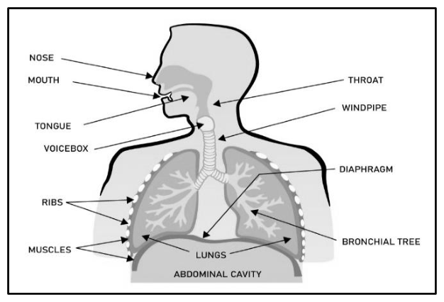
  <figcaption>圖 5-1．呼吸道、肺臟與胸廓（原書 p.60） 原文圖說：Figure 5-1. Airway, lungs, and the rib cage</figcaption>
</figure>

**5-7.** 橫膈膜與肋間肌受腦部呼吸中樞控制，自動收縮與放鬆。**吸氣**使胸廓變大，**呼氣**使胸廓縮小。當胸廓先擴大再縮小時，肺內氣壓先低於、後高於大氣壓，因而使空氣衝入與衝出肺臟以達成壓力平衡。

---

## 5.2　呼吸道控制所用裝備

**5-8.** CoTCCC 建議的**鼻咽呼吸道（NPA）** 附潤滑劑，是一種非無菌的橡膠管狀器材，插入傷患鼻孔使用。它的作用如同楔子，防止舌頭後倒進入口腔後方通往氣管的空間，藉此維持呼吸道通暢。制式配發的 JFAK 中僅有 **32 Fr（French）尺寸**的 NPA。插入前不一定要量測尺寸，但量測有助於減少鼻咽創傷或避免引發傷患的嘔吐反射。潤滑劑為水性物質，有助於將器材插入鼻腔。**使用 NPA 屬於第二級（Tier 2）技能。**

> **譯註**：原文此處敘述略有矛盾（「不必要」與「重要」並陳），譯文依原文照譯，實務上請以單位訓練規範為準。

> ### ⚠️ 注意（CAUTION）
>
> **不可**使用血液或其他體液來潤滑 NPA。

---

## 5.3　呼吸道控制第一級（Tier 1）技能

**5-9.** 呼吸道控制的第一級 TCCC 技能，涵蓋各種為因應呼吸道阻塞與呼吸窘迫而設計的技術與程序。在高風險、高變動的情境中，服役人員精熟這些技能至關重要——迅速而精確的介入，在戰場上可能就是生與死的分別。

### 5.3.1　安全擺位以打開呼吸道

**5-10.** 檢查傷患反應（見第 61 頁圖 5-2 步驟 A）：輕搖傷患並詢問「你還好嗎？」以確認其意識狀態。**呼叫支援**（見第 61 頁圖 5-2 步驟 B），接著將無意識傷患擺成**復甦姿勢**——頭部後仰、下巴遠離胸口（見第 61 頁圖 5-2 步驟 C），作法為——

- 將傷患雙腿擺直。
- 移動傷患**靠近你這一側**的手臂，使其伸直並高舉過頭；另一側手臂同樣處理，置於身側。
- 跪在傷患身旁，膝蓋靠近其肩部（保留讓身體翻滾的空間）。
- 一手置於其頭頸後方支撐，另一手抓住傷患腋下（見第 61 頁圖 5-2 步驟 C）。
- 以**穩定、均勻**的力道將傷患朝自己翻轉。傷患的**頭頸須與背部保持一直線**。

**5-11.** 復甦姿勢可讓血液與黏液自傷患口鼻流出，而不會倒流回呼吸道。但若懷疑有頸部傷勢、將採用提下顎法時，則應跪在傷患**頭側、面朝其腳部**的位置。

> ### ⚠️ 警告（WARNING）
>
> 若傷患俯臥（面朝下），**須將其身體視為一個整體小心翻轉**，避免軀幹扭轉。扭轉可能使背部、頸部或脊椎傷勢更加複雜。

<figure>
  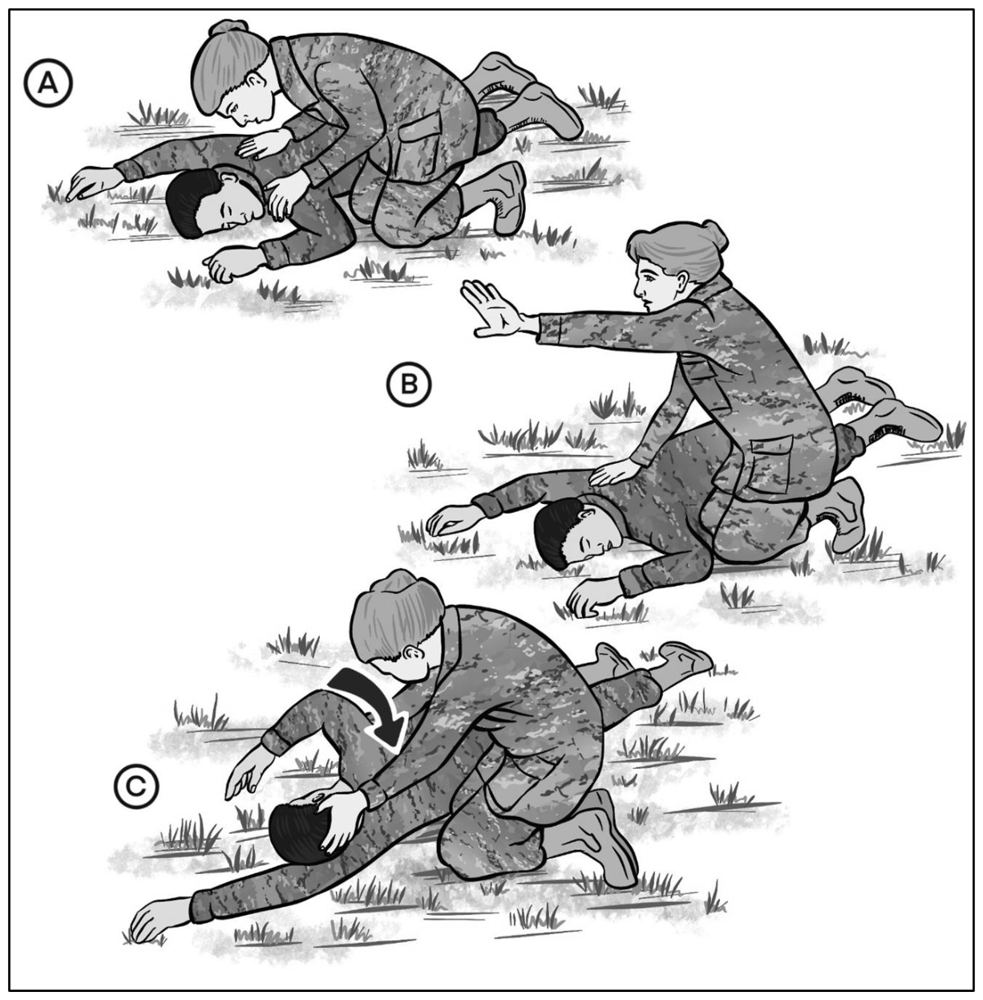
  <figcaption>圖 5-2．傷患擺位（原書 p.61） 原文圖說：Figure 5-2. Casualty positioning</figcaption>
</figure>

### 5.3.2　呼吸道阻塞

**5-12.** 氧氣進出肺臟需要通暢的呼吸道，但阻塞可能因多種因素發生：

- **意識喪失**可能使舌頭後倒進入咽喉，若未妥善處理即造成阻塞。
- **異物**（尤其是食物）可能在進食時卡在咽喉，特別是未經充分咀嚼即吞下大塊食物時；飲酒或假牙鬆脫會加劇此風險。
- **胃內容物逆流**，或頭頸顏面傷勢造成的**血塊形成**，都可能進一步造成呼吸道阻塞。
- 對受傷或無意識的傷患，**確保正確擺位並維持呼吸道通暢**，以降低上述風險。

**5-13.** 上呼吸道阻塞是可能危及生命的緊急狀況，可能是**部分**或**完全**阻塞。阻塞的嚴重度與性質，凸顯了快速辨識與立即介入以防止呼吸功能受損的重要性。及早辨識徵象並有效回應，是維持呼吸道通暢與支持呼吸的關鍵，攸關傷患存活。此情境要求迅速而果斷的行動，以解除阻塞並確保呼吸道通暢。

#### 部分呼吸道阻塞

**5-14.** 傷患可能仍有氣體交換。**良好的氣體交換**是指傷患能夠**用力咳嗽**，儘管咳嗽之間可能伴有喘鳴。此時施救者**不應介入**，而應鼓勵傷患自行把阻塞物咳出。若咳嗽無力、且咳嗽之間出現**高頻音**，可能代表氣體交換不良——此時應介入協助，並**比照完全阻塞處理**。

#### 完全呼吸道阻塞

**5-15.** 若傷患**完全無法說話、呼吸或咳嗽**，即為完全阻塞（無氣體交換）。傷患可能雙手掐住頸部、動作慌亂。對於無意識傷患，若打開其呼吸道後仍無法為其換氣，同樣代表完全阻塞。**部分異物阻塞合併氣體交換不良、或完全阻塞的傷患，若無醫療介入將無法存活。兩種情況的處置方式相同。**

### 5.3.3　為無意識或無呼吸的傷患打開呼吸道

**5-16.** **舌頭是呼吸道阻塞最常見的單一原因**（見圖 5-3）。多數情況下，只要使用**壓額抬下巴法（head-tilt/chin-lift）** 或**提下顎法（jaw-thrust）** 即可打開呼吸道——此動作能將舌頭拉離咽喉的氣道（見圖 5-4）。

<figure>
  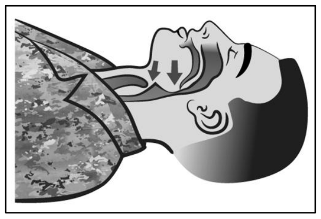
  <figcaption>圖 5-3．呼吸道，阻塞狀態（原書 p.62） 原文圖說：Figure 5-3. Airway, blocked</figcaption>
</figure>

<figure>
  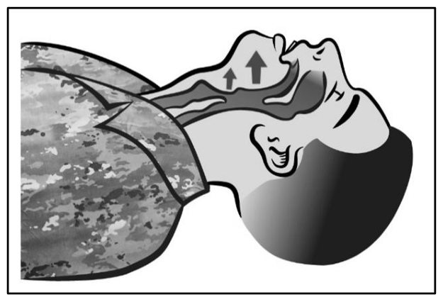
  <figcaption>圖 5-4．呼吸道，通暢狀態（原書 p.62） 原文圖說：Figure 5-4. Airway, opened</figcaption>
</figure>

**5-17.** 呼叫支援，接著為傷患擺位：依第 60 頁第 5-10 段所述，將傷患翻轉為仰臥。

**5-18.** 若在呼吸道內**看見**異物，應嘗試將其取出。**不要**把手指伸進口中，去摸索或取出看不見的可能阻塞物——這可能把異物推得更深。以壓額抬下巴法打開呼吸道。

> **註**：若口中可見異物或嘔吐物，應儘速清除。

> ### ❗ 重要（IMPORTANT!）
>
> 清除**看得見**的異物，但**不可**進行盲目的手指清掃（blind finger sweep）。

> ### ⚠️ 注意（CAUTION）
>
> 壓額抬下巴法是打開呼吸道的重要程序；然而施行時須**格外謹慎**，過度施力可能造成進一步的脊椎傷害。
>
> 對於疑似頸部傷勢或嚴重頭部創傷的傷患，打開呼吸道最安全的方式是**提下顎法**，因為多數情況下該法無須將頸部後仰即可完成。

#### 壓額抬下巴法（Head-Tilt/Chin-Lift）

**5-19.** 一手置於傷患前額，以掌根施加穩固的向後壓力使頭部後仰；另一手指尖置於**下顎骨質部位**下方向上提起，使下巴前移。**不可用拇指抬下巴**（見圖 5-5）。

> **註**：手指**不應深壓**下巴下方的軟組織，否則可能反而造成呼吸道阻塞。

<figure>
  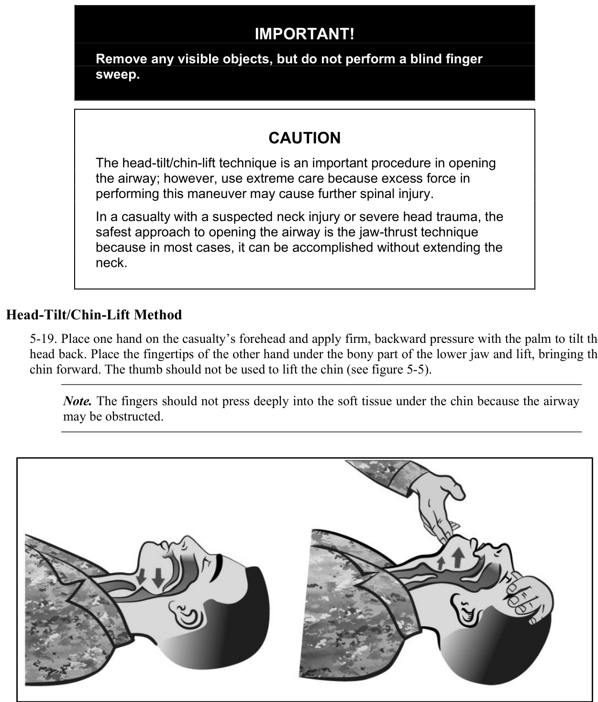
  <figcaption>圖 5-5．壓額抬下巴法打開呼吸道（原書 p.63） 原文圖說：Figure 5-5. Head-tilt/chin-lift technique of opening the airway</figcaption>
</figure>

#### 提下顎法（Jaw-Thrust）

**5-20.** 提下顎法的施行方式為：施救者以雙手分別抓住傷患下顎兩側的下顎角，同時向上、向前提起下顎（見圖 5-6）。施救者的**手肘應撐在傷患躺臥的平面上**。若嘴唇閉合，可用拇指將下唇往下拉開。若需施行口對口人工呼吸，可用你的臉頰緊貼傷患鼻孔將其封閉。**頭部須小心支撐，不可後仰，也不可左右轉動**；若此法不成功，才可讓頭部略微後仰。對於疑似頸部傷勢的傷患，提下顎法是打開呼吸道最安全的首選方式，因為多數情況下無須將頸部後仰即可完成。

<figure>
  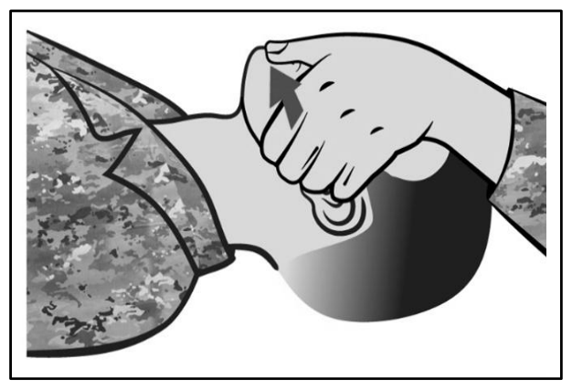
  <figcaption>圖 5-6．提下顎法打開呼吸道（原書 p.64） 原文圖說：Figure 5-6. Jaw-thrust technique of opening the airway</figcaption>
</figure>

> **註**：若下顎前移後傷患嘴唇仍閉合，用你的雙拇指將下唇拉開，讓空氣得以進入傷患口中。

**5-21.** 提下顎法在訓練中經常被強調，但在戰場實務上有時反而形成干擾。創傷案例中的頸部傷勢，通常與墜落、車禍等劇烈事件有關；多數頸部傷害在**撞擊當下即已造成**，其傷害程度在現場通常是**立即決定且無法改變**的。若確有頸部創傷，往往必須施行提下顎法以確保呼吸道通暢，並維持該姿勢直到增援人員抵達。此項處置讓施救者得以繼續推進 MARCH 流程。

### 5.3.4　呼吸道管理

**5-22.** 若傷患能自主呼吸、但意識不清或半清醒，且無呼吸道阻塞，管理呼吸道的最佳方式是使用 **NPA**。NPA 對清醒與無意識的傷患皆適用，能有效協助打開或維持呼吸道通暢。此方式可確保呼吸道保持淨空，使呼吸更為順暢，並可能防止進一步的併發症。

**5-23.** 嚴重顏面創傷的傷患，往往可藉由**坐起並前傾**來自行保護呼吸道。對清醒的傷患，協助其採取任何能讓自己順暢呼吸的舒適坐姿。若傷患無意識但仍有呼吸，則應擺成**復甦姿勢**（見第 65 頁圖 5-7）。

<figure>
  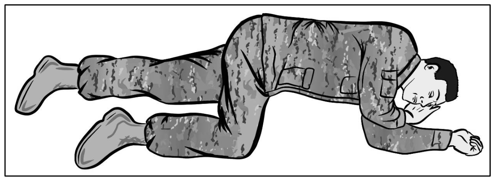
  <figcaption>圖 5-7．無意識傷患的復甦姿勢（原書 p.65） 原文圖說：Figure 5-7. Unconscious Casualty Recovery Position</figcaption>
</figure>

**5-24.** 復甦姿勢可讓血液與黏液自傷患口鼻流出，而不會倒流回呼吸道；同時也有助於在傷患嘔吐時避免吸入嘔吐物。**若傷患能自主呼吸，就讓其自行採取最能順暢呼吸的姿勢（舒適姿勢），包括坐起。**

---

## 5.4　呼吸道控制第二級（Tier 2）技能

**5-25.** 第二級呼吸道控制技能的主要目標，是確認第一級技能已經施行，再加上第二級專屬的**鼻咽呼吸道置入**，並持續監測傷患是否出現第 5-3 段所述的呼吸道受損徵象。若傷患出現無法自主呼吸的徵象，**必須立即通知醫療人員**。醫療人員可能會要求戰鬥救生員（CLS）協助，使用**甦醒球面罩（bag valve mask, BVM）** 提供呼吸支援（見圖 5-8）。當觀察到呼吸減弱時，就有必要以 BVM 提供換氣支持，醫療人員可能會請 CLS 協助操作。

<figure>
  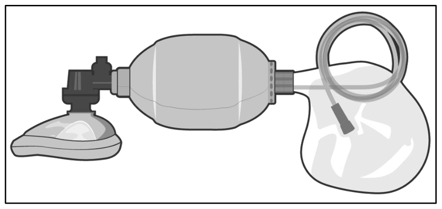
  <figcaption>圖 5-8．甦醒球面罩（原書 p.65） 原文圖說：Figure 5-8. Bag valve mask</figcaption>
</figure>

**5-26.** 若傷患因缺乏自主呼吸而需要持續 BVM 支援，且並非剛施用鎮靜性止痛藥物所致，這可能代表其傷勢或狀況需要**提前或立即後送**（例如嚴重創傷性腦損傷，TBI）。若無法取得確定性治療或後送，且資源有限、或資源用在存活機會較高的傷患身上更為適當時，應考慮將該傷患**分類為期待（expectant）**。

**5-27.** 換氣可由一人單獨施行，或由兩人協同施行。面罩以「**E-C 夾持法**」握持（見第 66 頁圖 5-9），罩在傷患口鼻上密合，使空氣不外漏（見第 66 頁圖 5-10）。接著穩固擠壓甦醒球**一至二秒**，每次間隔**五至六秒**。Deployed Medicine 網站設有單人與雙人 BVM 正確操作的教學影片。

<figure>
  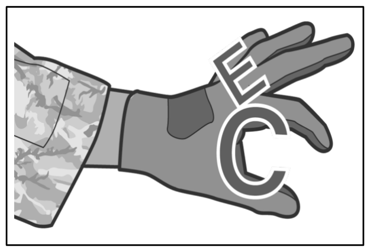
  <figcaption>圖 5-9．甦醒球面罩握持技巧（原書 p.66） 原文圖說：Figure 5-9. Bag valve mask holding technique</figcaption>
</figure>

<figure>
  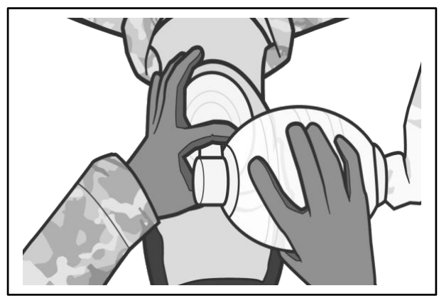
  <figcaption>圖 5-10．甦醒球面罩罩於傷患口鼻（原書 p.66） 原文圖說：Figure 5-10. Bag valve mask applied to casualty</figcaption>
</figure>

---

## 5.5　呼吸道控制的應急技術

**5-28.** 呼吸道控制的應急技術在 TCCC 中極為重要，因為戰鬥情境中呼吸道受損會構成立即的生命威脅。受傷的服役人員可能出現呼吸道阻塞、呼吸窘迫或意識喪失，並可能迅速惡化為危及生命的狀況。壓額抬下巴法、提下顎法與 NPA 等應急呼吸道控制技術，能使足夠的呼吸與氧合迅速恢復。這些技術可由受訓人員快速施行，即使在混亂與高壓的環境中也能及時介入。透過迅速處置呼吸道受損，TCCC 的應急技術在保全生命、防止進一步併發症、以及最大化戰場傷者的存活機會上，扮演了關鍵角色。

### 5.5.1　打開阻塞的呼吸道——意識清醒的傷患

**5-29.** 為意識清醒的傷患清除呼吸道阻塞時，傷患可維持站姿或坐姿。但必須認知到：呼吸道阻塞會導致**腦部缺氧**，進而造成呼吸停止、意識喪失，若未及時矯正將導致死亡。

**5-30.** 評估與處置呼吸道阻塞時，先詢問傷患**是否能說話、是否正在哽塞**，並檢查有無**哽塞通用手勢**（見第 67 頁圖 5-11）。若傷患能有效說話或咳嗽，鼓勵其繼續咳嗽——這代表其氣體交換仍良好，**你不應介入**其排除阻塞物的努力。

<figure>
  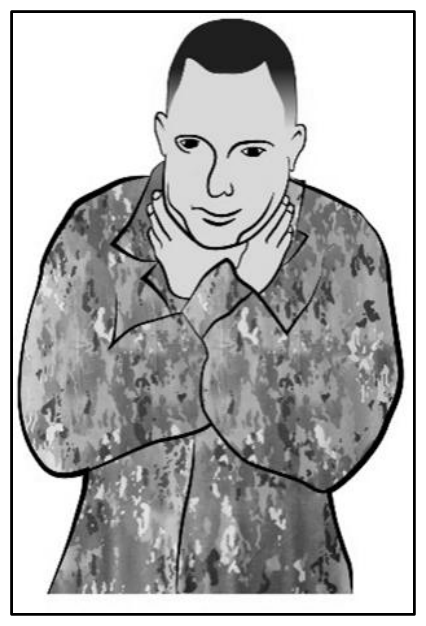
  <figcaption>圖 5-11．哽塞通用手勢（原書 p.67） 原文圖說：Figure 5-11. The universal sign for choking</figcaption>
</figure>

**5-31.** 然而，若你注意到傷患呼吸或咳嗽時出現**高頻音**（代表氣體交換不良），或傷患已無法呼吸，就必須立即行動。呼叫支援，並準備施行徒手推擠以清除阻塞。使用**腹部推擠法**（又稱**哈姆立克法**，Heimlich maneuver）：雙手置於腰部與胸廓之間，快速向上推擠。對於**懷孕後期、明顯肥胖、或腹部有重大傷口**的傷患，改用**胸部推擠法**：雙手置於胸骨中央，向內、向上猛力推壓。

**5-32.** 這類情境中迅速行動至為關鍵，才能恢復呼吸並防止包括死亡在內的進一步併發症。務必仔細評估狀況，依傷患的實際條件選用適當技術。

#### 施行腹部推擠

**5-33.** 施行腹部推擠之前，第一線施救者應先施予**五次拍背**。腹部推擠的程序如下：

1. 站在傷患身後，雙臂環抱其腰部。
2. 一手握拳，另一手包覆該拳。**拳頭的拇指側**應抵住傷患腹部，位於**身體中線、肚臍略上方，但要明顯低於胸骨尖端**（見第 68 頁圖 5-12）。
3. 以快速的**向後、向上**推力將拳頭壓入腹部（見第 68 頁圖 5-13）。

<figure>
  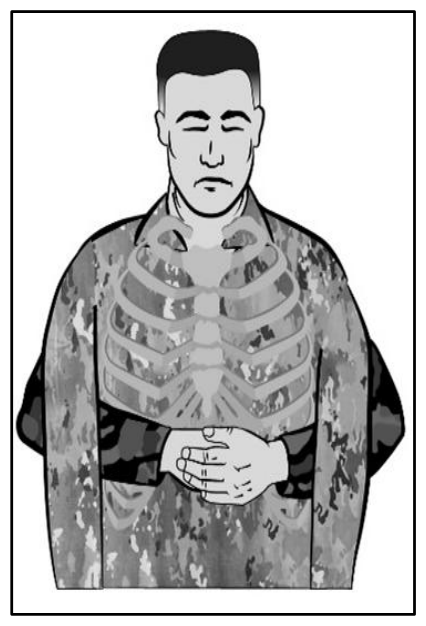
  <figcaption>圖 5-12．腹部推擠程序的解剖視角（原書 p.68） 原文圖說：Figure 5-12. Anatomical view of the abdominal thrust procedure</figcaption>
</figure>

<figure>
  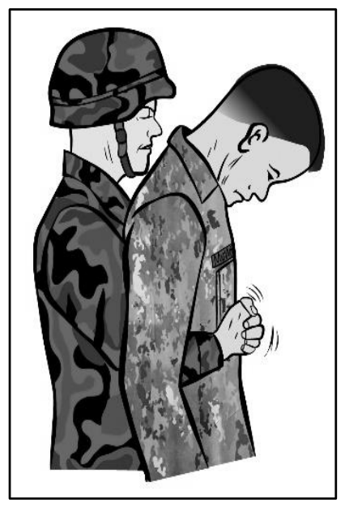
  <figcaption>圖 5-13．腹部推擠的側視圖（原書 p.68） 原文圖說：Figure 5-13. Profile view of the abdominal thrust</figcaption>
</figure>

4. 每一次推擠都應是**各自獨立、界線分明**的動作。
5. 持續施行腹部推擠，直到阻塞物被排出，或傷患失去反應。
6. 若傷患失去反應，一面呼叫支援，一面接續執行打開呼吸道的步驟。

#### 施行胸部推擠

**5-34.** **胸部推擠法**是腹部推擠的替代技術，適用於傷患有腹部傷口、懷孕、或體型過大以致你無法環抱其腹部時。對**坐姿或站姿**傷患施行胸部推擠：

1. 站在傷患身後，雙臂自其**腋下**穿過環抱胸部。
2. 一手握拳，將**拳頭的拇指側**置於**胸骨正中**（注意避開胸骨尖端與肋骨下緣）。
3. 另一手包覆該拳並施加推力（見第 69 頁圖 5-14）。

<figure>
  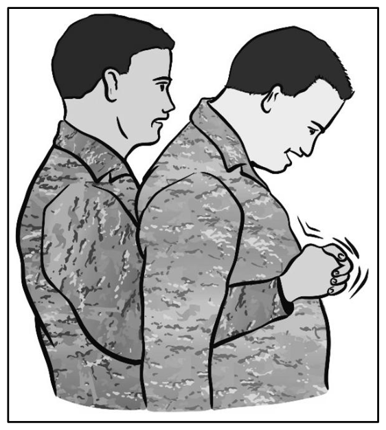
  <figcaption>圖 5-14．胸部推擠的側視圖（原書 p.69） 原文圖說：Figure 5-14. Profile view of the chest thrust</figcaption>
</figure>

4. 每一次推擠都應**緩慢、界線分明**，且以解除阻塞為目的。
5. 持續施行胸部推擠，直到阻塞物被排出，或傷患失去反應。
6. 若傷患失去反應，一面呼叫支援，一面接續執行打開呼吸道的步驟，並施行人工呼吸。

### 5.5.2　打開阻塞的呼吸道——臥倒或無反應的傷患

**5-35.** 當哽塞者在臥倒狀態下失去反應，或發現一名無意識者而其病因不明時，必須遵循特定的緊急處置流程來因應可能的呼吸道阻塞。

**5-36.** 若一名原本清醒的傷患開始哽塞、隨後失去意識，須立即採取以下行動：

1. 立刻呼叫支援，確保援助正在路上。
2. 打開傷患呼吸道，評估並處置阻塞。
3. **僅在口中可見阻塞物時**才進行手指清掃，以免將阻塞物推得更深。
4. 嘗試施行人工呼吸，藉此評估空氣能否進入肺部。口對口人工呼吸的詳細操作，見第 81 頁第 6-49 段。若因阻塞而換氣失敗，立即改依第 5-39 段所述程序清除呼吸道。

**5-37.** 若發現傷患時已無反應，程序略有不同：

1. 迅速評估現場，掌握狀況與嚴重程度。
2. 立即呼叫支援。
3. 將傷患擺成**仰臥**，以便有效管理並確保呼吸道。
4. 檢查脈搏，判定循環支持的急迫性。
5. 以建議手法打開呼吸道。
6. 確認傷患是否已無呼吸；若是，依第 81 頁第 6-49 段的準則嘗試施行人工呼吸。

**5-38.** 這些關鍵步驟的設計目的，是透過**及早清除呼吸道、及早恢復呼吸**來最大化復甦機會。此類緊急狀況中，迅速而有效的介入至關重要，這也凸顯了充分訓練與整備的重要性。

**5-39.** 若仍無法為傷患換氣，施行 **6 至 10 次**徒手推擠（腹部或胸部）。施行**腹部推擠**的方式：

1. **跨跪**在傷患大腿兩側（見圖 5-15）。

<figure>
  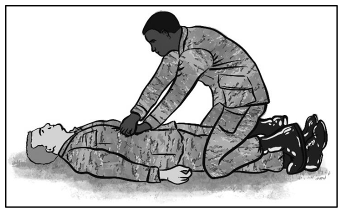
  <figcaption>圖 5-15．對無反應傷患施行腹部推擠（原書 p.70） 原文圖說：Figure 5-15. Abdominal thrust on an unresponsive casualty</figcaption>
</figure>

2. 將一手掌根抵在傷患腹部（**身體中線、肚臍略上方，但明顯低於胸骨尖端**），另一手疊放其上，**手指朝向傷患頭部**。
3. 以快速的**向前、向上**推力壓入傷患腹部。可運用自身體重完成此動作，每次推擠須快速且界線分明。
4. 視需要反覆進行「腹部推擠 → 手指清掃 → 人工呼吸（嘗試換氣）」的循環，直到異物自阻塞的呼吸道排出。
5. 若傷患胸部起伏，接著檢查其脈搏。

**5-40.** 施行**胸部推擠**時，將無反應的傷患擺成**仰臥面朝上**並打開其口部。第一線施救者跪在傷患身側靠近軀幹處，接著——

1. 以手指沿肋骨下緣往上滑，找出傷患**肋骨下緣的凹槽**（見第 71 頁圖 5-16 步驟 A）。
2. 將**中指**置於該凹槽，**食指**貼在中指旁、位於傷患胸骨下緣。
3. 將另一手的**掌根**置於胸骨下半部、緊鄰那兩根手指的位置（見第 71 頁圖 5-16 步驟 B）。
4. 將原本置於凹槽的手移開，疊放在胸骨上那隻手的上方，手指伸展或交扣（見第 71 頁圖 5-16 步驟 C）。
5. **打直並鎖住手肘**，肩膀垂直位於雙手正上方，不可彎肘、不可前後搖晃、不可讓肩膀下垂。
6. 施加足夠壓力使**胸骨下壓 1½ 至 2 英寸（約 4 至 5 公分）**，然後**完全釋放**壓力（見第 71 頁圖 5-16 步驟 D）。此按壓與釋放的過程須快速且界線分明，重複**六至十次**。第 71 頁圖 5-17 為胸骨下壓的另一視角。

> ### ⚠️ 注意（CAUTION）
>
> 施救者可能會感覺到肋骨斷裂——**這是可以接受的**，因為當下是危及生命的狀況。

<figure>
  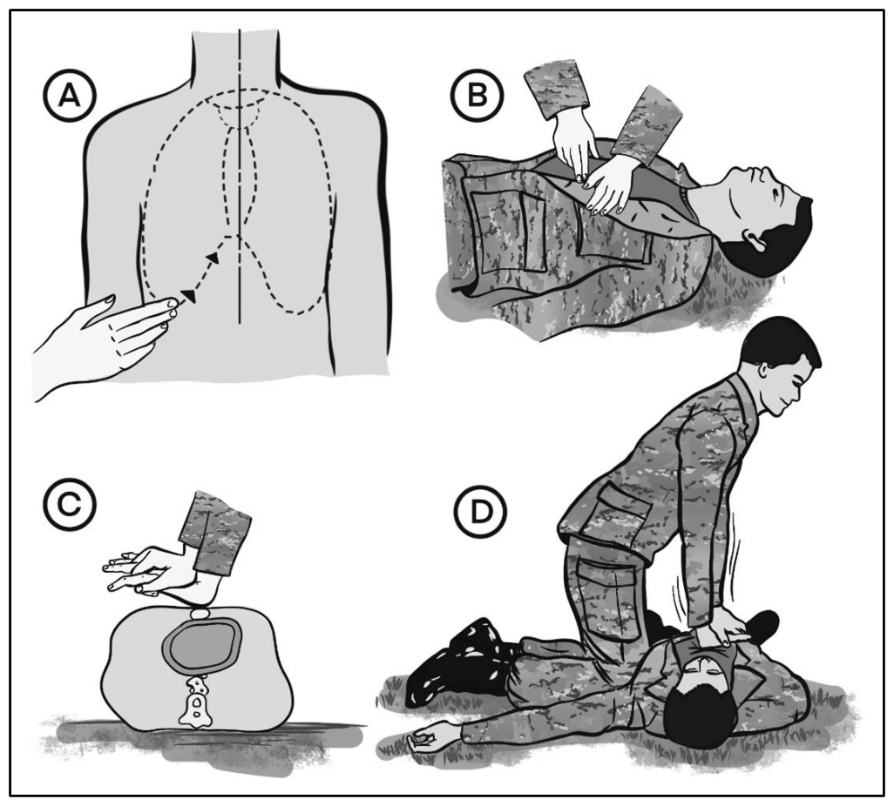
  <figcaption>圖 5-16．胸部推擠的手部位置（原書 p.71） 原文圖說：Figure 5-16. Hand placement for the chest thrust</figcaption>
</figure>

<figure>
  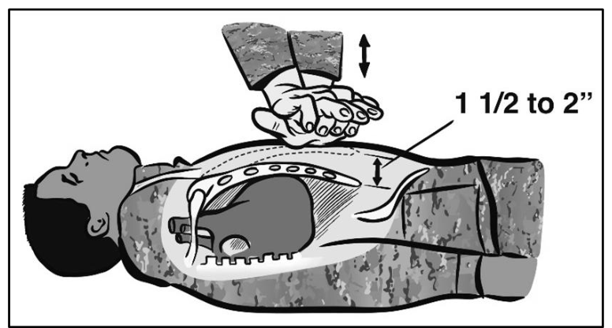
  <figcaption>圖 5-17．胸骨下壓 1½ 至 2 英寸（原書 p.71） 原文圖說：Figure 5-17. Breastbone depressed 1 1/2 to 2 inches</figcaption>
</figure>

**5-41.** 第一線施救者視需要反覆進行「胸部推擠 → 手指清掃 → 人工呼吸」的循環，直到異物自阻塞的呼吸道排出。若傷患胸部起伏，接著檢查其脈搏。

**5-42.** 若因呼吸道阻塞而無法施行人工呼吸，依下列方式清除阻塞——

1. 將傷患擺成**仰臥面朝上**；翻轉無反應的傷患時須**視為一個整體**同時轉動，並呼叫支援。
2. 施行手指清掃。
3. 使用**舌顎上提法（tongue-jaw lift）** 打開傷患口部：以拇指與其餘手指同時抓住傷患的**舌頭與下顎**並向上提起（見圖 5-18）。若無法打開其口部，改用**交叉手指法（crossed-finger method）**——拇指與食指交叉，拇指抵住傷患上排牙齒、食指抵住下排牙齒，將牙關撐開（見圖 5-19）。

<figure>
  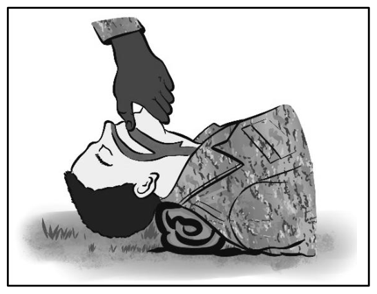
  <figcaption>圖 5-18．打開傷患口部（舌顎上提法）（原書 p.72） 原文圖說：Figure 5-18. Opening the casualty's mouth (tongue-jaw lift)</figcaption>
</figure>

<figure>
  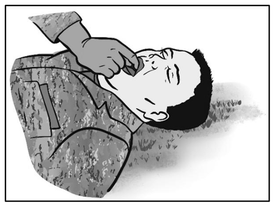
  <figcaption>圖 5-19．打開傷患口部（交叉手指法）（原書 p.72） 原文圖說：Figure 5-19. Opening the casualty's mouth (crossed-finger method)</figcaption>
</figure>

4. 將另一手的**食指**沿頰內側伸入至舌根，自口腔一側朝中央以**鉤取**的動作將異物撥出（見圖 5-20）。

<figure>
  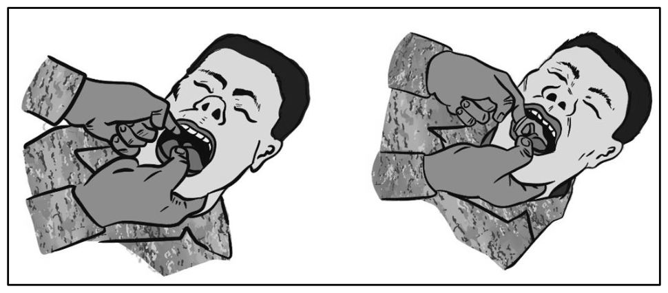
  <figcaption>圖 5-20．以手指撥出異物（原書 p.72） 原文圖說：Figure 5-20. Using a finger to dislodge a foreign body</figcaption>
</figure>

> ### ⚠️ 警告（WARNING）
>
> 小心不要用手指把異物**往更深處推入**呼吸道。

---

## 附錄　本章新增術語對照表

> 沿用第 4 章術語表，以下為本章新增條目。

| 英文 / 縮寫 | 繁體中文譯法 | 備註 |
|---|---|---|
| NPA (nasopharyngeal airway) | 鼻咽呼吸道 | JFAK 配發 32 Fr 一種尺寸 |
| BVM (bag valve mask) | 甦醒球面罩 | 又稱袋瓣罩甦醒器 |
| head-tilt/chin-lift | 壓額抬下巴法 | |
| jaw-thrust | 提下顎法 | 疑似頸傷時的首選 |
| recovery position | 復甦姿勢 | |
| airway obstruction | 呼吸道阻塞 | 分部分／完全 |
| air exchange | 氣體交換 | |
| abdominal thrust / Heimlich maneuver | 腹部推擠法 / 哈姆立克法 | |
| chest thrust | 胸部推擠法 | 孕婦、肥胖、腹部傷口時改用 |
| back blow | 拍背 | 腹部推擠前先施五次 |
| finger sweep | 手指清掃 | 僅限可見異物，禁止盲目清掃 |
| tongue-jaw lift | 舌顎上提法 | |
| crossed-finger method | 交叉手指法 | |
| rescue breathing | 人工呼吸 | |
| “E-C” holding technique | E-C 夾持法 | BVM 面罩握持 |
| universal sign for choking | 哽塞通用手勢 | |
| rib cage | 胸廓 | |
| breastbone | 胸骨 | |
| diaphragm | 橫膈膜 | |
| windpipe | 氣管 | |
| bronchial tree | 支氣管樹 | |
| gag reflex | 嘔吐反射 | |
| basilar skull fracture | 顱底骨折 | NPA 使用禁忌 |
| midface | 顏面中段 | |
| nasopharynx | 鼻咽 | |
| TBI (traumatic brain injury) | 創傷性腦損傷 | |
| expectant (triage category) | 期待（傷檢分類） | 資源有限時的分類 |
| prone position | 俯臥 | |
| position of comfort | 舒適姿勢 | 讓傷患自行選擇 |

---

*本章譯稿完成，段落 5-1 至 5-42。原文含圖 5-1 至 5-20 共 20 張。*
