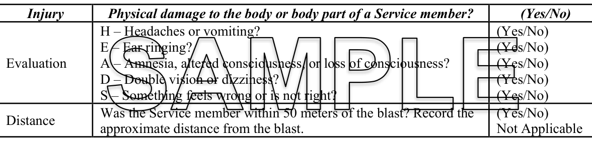
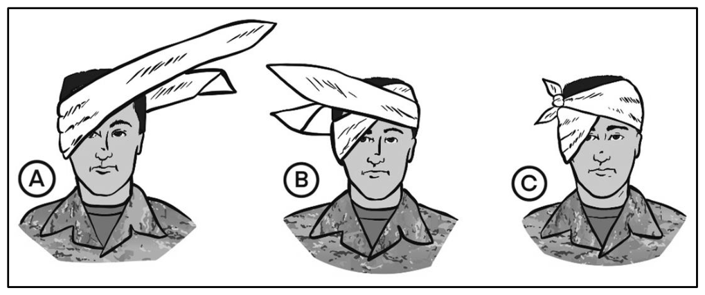
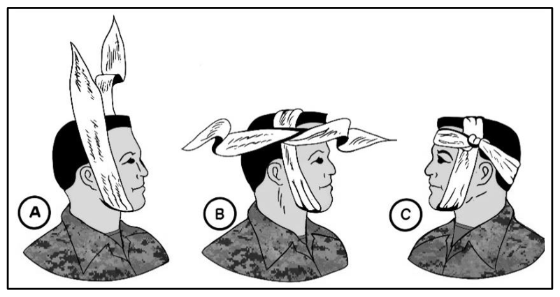

# 第 11 章　頭部傷勢

> **來源**：ATP 4-02.11《陸軍傷患處置、戰術戰傷救護與急救技術準則》，2026 年 3 月 23 日版
> **對應原文**：Chapter 11 — Head Injury（印刷頁 107–114 / PDF 頁 121–128）
> **譯註**：本譯稿以繁體中文為主體，專有名詞首次出現時附上英文原文與縮寫。圖片位置以標註保留，影像於全書文字完成後統一處理；圖 11-1 為表格形式，其內容已完整譯出於標註下方。

---

## 11.1　頭部傷勢概論

**11-1.** 頭部傷勢是常見的問題，可能因意外、跌落或運動相關事件而發生。頭部承受強力撞擊時，可能造成不同類型的傷害。理解頭部傷勢，有助於服役人員採取必要預防措施以保護自己或他人。**將頭部傷勢的發現回報給現場醫療人員至關重要**——缺乏迅速且適當的醫療照護，會使頭部傷勢與最終預後惡化。頭部創傷可能是**鈍傷**或**穿刺傷**，大致可分為**開放性**與**閉鎖性**頭部傷勢。

### 11.1.1　開放性頭部傷勢

**11-2.** **開放性頭部傷勢**（又稱開放性顱骨傷勢）指顱骨破裂或被穿透、使腦部暴露於外在環境的傷勢，通常伴隨頭皮、顱骨或**腦膜（meninges，腦部的保護層）** 的可見損傷。其徵象與症狀依傷勢的嚴重度與確切位置而異。**開放性頭部傷勢屬醫療急症**，一旦懷疑，務必立即尋求醫療處置以進行評估、診斷與適當治療。

**11-3.** 開放性頭部傷勢常見的徵象與症狀為：

- **可見的頭部傷口**。開放性頭部傷勢通常伴隨頭皮或顱骨上可見的傷口或撕裂傷，可能有出血，或骨頭外露的開放性骨折。
- **大量出血**。血管受損可能造成顯著出血。血液可能出現在頭皮、臉部，嚴重時頭部傷口會大量出血。
- **顱骨變形**。部分情況下可見顱骨明顯變形或凹陷，代表顱骨骨折或骨頭移位。
- **意識喪失**。依傷勢嚴重度而定，可能短暫或長時間失去意識。
- **清澈液體或血液滲出**。**腦脊髓液（cerebrospinal fluid）** 或血液自鼻、耳或傷口滲漏，代表傷勢較為嚴重，應以急症處理。
- **劇烈頭痛**。開放性頭部傷勢後常出現強烈且持續的頭痛。
- **噁心與嘔吐**。
- **意識混亂與定向感喪失**。服役人員可能出現意識混亂、記憶喪失、注意力難以集中，或顯得失去方向感。
- **癲癇發作**。開放性頭部傷勢後可能出現癲癇發作，腦部直接受影響時尤其如此。
- **言語或視覺改變**。可能出現說話困難、視力問題、複視或其他感覺障礙。
- **無力或麻木**。特定身體部位無力或麻木，可能是頭部傷勢造成神經損傷的徵象。

### 11.1.2　閉鎖性頭部傷勢

**11-4.** **閉鎖性頭部傷勢**指沒有開放性傷口、顱骨也未被穿透的頭部創傷，傷害發生在**顱骨內部**。閉鎖性頭部傷勢通常源於鈍力撞擊、跌落或意外，腦部承受突然的**加速、減速或旋轉力**。**腦震盪是最常見的閉鎖性頭部傷勢類型。閉鎖性頭部傷勢可能不明顯、也可能難以察覺。**

**11-5.** 閉鎖性頭部傷勢的嚴重度範圍很廣，從輕微腦震盪到更嚴重的形式，例如**挫傷、瀰漫性軸突損傷（diffuse axonal injury）** 或**顱內出血（intracranial hemorrhage）**。一旦懷疑閉鎖性頭部傷勢，務必尋求醫療處置——對腦部的衝擊可能造成嚴重後果，需要適當的評估與處置。

**11-6.** 閉鎖性頭部傷勢的徵象與症狀依嚴重度而異。輕微者可能只出現細微症狀，嚴重者則可能立即產生明顯影響。常見徵象與症狀為：

- 頭痛或頭部壓迫感。
- 噁心與嘔吐。
- 頭暈與平衡問題。
- 意識混亂與定向感喪失。
- 記憶喪失或注意力難以集中。
- 情緒與行為改變。
- 感覺變化，例如視力模糊或耳鳴。
- 對光線與聲音敏感。
- 意識喪失（嚴重時）。

**11-7.** 頭部受傷後若出現上述任一徵象，務必尋求醫療處置——這些徵象可能代表從輕微腦震盪到更嚴重腦部創傷的各種嚴重度。上述症狀可能在受傷後**立即出現，也可能隨時間逐漸浮現**，且因人而異。

### 11.1.3　腦震盪

**11-8.** **腦震盪（concussion）** 是一種創傷性腦損傷，發生於腦部在顱骨內經歷突然而劇烈的移動時。它通常由頭部或身體遭受打擊、震動或碰撞所引起，會擾亂腦部的正常運作。

**11-9.** 腦震盪可能發生在各種情境中，例如運動傷害、跌落、車禍，或任何涉及頭部重大撞擊的事件。**腦震盪甚至可能在頭部未直接受到撞擊的情況下發生**——身體劇烈移動或搖晃，仍可能使腦部在顱骨內晃動而造成腦震盪。

**11-10.** 腦震盪的主要特徵是**腦部功能的暫時性中斷**。**腦震盪未必伴隨意識喪失——事實上，多數腦震盪發生時當事人並未失去意識。** 常見症狀包括：

- 頭痛或頭部壓迫感。
- 頭暈或輕飄感。
- 意識混亂或感覺思緒不清。
- 記憶問題或注意力難以集中。
- 疲勞或倦怠感。
- 噁心或嘔吐。
- 對光線或噪音敏感。
- 睡眠模式改變。
- 易怒或情緒變化。
- 視力模糊或平衡困難。

**11-11.** 一旦懷疑腦震盪，務必尋求醫療處置——醫療專業人員可評估傷勢嚴重度，並提供適當的康復指引。腦震盪的初期處置包括**休息**，並避免可能使腦部進一步受傷的活動。建議**身體與認知都要休息**，讓腦部得以妥善癒合。部分情況下，當事人可能需要暫時限制上課或工作等活動以促進康復；通常建議在醫療專業人員指導下**逐步**恢復正常活動。

**11-12.** 每一次腦震盪都是獨特的，症狀與恢復時間因人而異。經適當休息，多數人可完全康復。但在部分情況下，症狀可能持續或惡化，並可能發展出所謂的**腦震盪後症候群（post-concussion syndrome）**。

### 11.1.4　頭部傷勢相關的挫傷

**11-13.** **挫傷（contusion）** 指皮膚下方組織或血管受損的傷害，通常由鈍力撞擊造成，即一般所稱的**瘀青**。挫傷發生時，血管受損導致出血，隨後造成皮膚變色。

**11-14.** 就頭部傷勢而言，挫傷可能因頭部遭受直接打擊或創傷而發生。當頭部承受重大撞擊時，腦部可能撞上顱骨內側表面而造成挫傷，此類傷害稱為**腦挫傷（cerebral contusion）**。

**11-15.** 腦挫傷可歸類為**對衝傷（coup-contrecoup injury）**——意即挫傷可能同時發生在**撞擊處（coup）**，以及腦部反彈撞上顱骨所造成的**對側（contrecoup）**。這類傷害之所以令人憂心，是因為它們涉及**腦組織本身**的損害。

**11-16.** 腦挫傷的嚴重度從輕微到嚴重不等。較嚴重時，挫傷可能導致**顱內壓升高、腦部腫脹**，以及可能危及生命的併發症。

**11-17.** 一旦懷疑頭部傷勢，務必立即尋求醫療處置——迅速評估與治療是防止進一步併發症的關鍵。腦挫傷的症狀可能包括：

- 視覺改變。
- 意識混亂。
- 說話困難。
- 頭暈。
- 頭痛。
- 意識喪失。
- 噁心。
- 癲癇發作。
- 嘔吐。
- 無力。

**11-18.** 腦挫傷的治療重點在於處置底層傷勢並防止進一步損害，可能包括休息、疼痛控制、觀察、密切監測神經學狀態，以及在較嚴重時以**手術介入**來緩解壓力、清除血塊或受損組織。

---

## 11.2　頭部傷勢處置所用裝備

**11-19.** 處置頭部傷口所需的裝備不多。服役人員需要**拋棄式手套**以保護自己與傷者免於潛在感染；**無菌紗布墊或乾淨布料**對於覆蓋傷口、加壓止血至關重要；**黏性繃帶或醫療膠帶**用於固定紗布。此外，**溫和的消毒液或消毒濕巾**對於清潔傷口、預防感染很重要。最後，若懷疑有顱骨或頸部傷勢，可用**三角巾或紗布繃帶**製作臨時敷料或吊帶來支撐頭部。

---

## 11.3　頭部傷勢處置第一級（Tier 1）技能

**11-20.** 服役人員未必有時間或專業能力對頭部傷勢施行大範圍處置。**出現第 11-17 段所述任一症狀的服役人員，應在戰術上可行的情況下儘速後送。**

---

## 11.4　頭部傷勢處置第二級（Tier 2）技能

**11-21.** 出現第 11-17 段所述任一症狀的服役人員，應在戰術上可行的情況下儘速後送。此外，CLS 應完成 **DODI 6490.11**（國防部指令）所規定的「**傷害／評估／距離檢核表**」（injury/evaluation/distance，通稱 **I.E.D. 檢核表**）。此檢核表用於蒐集資訊，並辨識頭部傷勢的徵象與症狀。

**11-22.** 指揮官或其代表人員，必須儘速使用傷害／評估／距離檢核表（圖 11-1），評估**所有涉及潛在腦震盪事件的服役人員——包括外表無明顯傷勢者**。

<figure>
  
  <figcaption>圖 11-1．傷害／評估／距離檢核表（原書 p.110） 原文圖說：Figure 11-1. The Injury/Evaluation/Distance Checklist</figcaption>
</figure>

> *原文此圖為表格形式（標示為 SAMPLE 範例），內容完整譯出如下：*

| 項目 | 檢核內容 | 作答 |
|---|---|---|
| **傷害（Injury）** | 服役人員的身體或身體部位是否有物理性損傷？ | 是／否 |
| **評估（Evaluation）** | **H** — 是否頭痛或嘔吐？ | 是／否 |
| | **E** — 是否耳鳴？ | 是／否 |
| | **A** — 是否失憶、意識狀態改變或意識喪失？ | 是／否 |
| | **D** — 是否複視或頭暈？ | 是／否 |
| | **S** — 是否感覺哪裡不對勁？ | 是／否 |
| **距離（Distance）** | 該服役人員是否位於爆炸點 **50 公尺**以內？請記錄距爆炸點的約略距離。 | 是／否 不適用 |

> **譯註**：評估欄的 **H-E-A-D-S** 是英文助記字（Headaches／Ear ringing／Amnesia／Double vision／Something feels wrong），拼起來即 "HEADS"（頭）。中譯無法保留此諧音，故保留原字母並譯出各項內容。

**11-23.** 依 **DODI 6490.11** 規定，涉及潛在腦震盪事件的服役人員**必須**轉介接受醫療評估。若其在傷害／評估／距離檢核表上有任何一項回答「**是**」，或在事件後任何時間點出現任何腦震盪相關症狀，此轉介即為**強制性**。傷害／評估／距離評估完成後，務必為事件中所有相關人員記錄結果，並將這些記錄併入**重要活動報告（significant activities report）** 提報——所有爆炸相關事件，或 DODI 6490.11 所列的其他事件，都要求提報此報告。此程序可確保所有潛在腦震盪都獲得迅速而有效的處理，維護服役人員的健康與福祉。

**11-24.** 處置疑似頭部傷勢的創傷傷患時，必須依據 **MACE 2（軍用急性腦震盪評估卡第 2 版）** 向醫療人員回報特定的關鍵觀察結果。**受傷後立即評估，可顯著提升評估的有效性。** 若傷患出現下列任一徵象，即應懷疑**創傷性腦損傷（TBI）**：

- 意識程度**持續惡化**。
- 出現複視。
- 出現躁動加劇、好鬥或激動的行為。
- **反覆嘔吐**。
- 結構性腦損傷偵測裝置（若有的話）呈陽性結果。
- 癲癇發作。
- 手臂或腿部無力或刺麻感。
- 劇烈或持續惡化的頭痛。

**11-25.** 若出現上述任一徵象或症狀，**必須立即回報**給抵達現場的醫療人員。頭部傷勢的完整通報與處置準則，詳見 **DODI 6490.11**。此規範可確保潛在的創傷性腦損傷獲得迅速辨識與適當處置。

---

## 11.5　頭部、頸部與顏面傷勢的應急技能

**11-26.** 部分傷口與燒傷在施行處置措施時，需要特別的預防與程序。本節說明頭部、頸部與顏面傷口的具體急救程序，也討論在特定身體部位施加敷料與繃帶的技術。

**11-27.** 頭部傷勢的範圍很廣，從頭皮的輕微擦傷或切割傷，到可能導致意識喪失甚至死亡的嚴重腦部傷害。頭部傷勢分為**開放性**與**閉鎖性**傷口：開放性傷口是可見的、皮膚有破損，且通常有出血跡象；閉鎖性傷口可能可見（例如顱骨凹陷），也可能讓急救者看不出任何明顯傷勢（例如內出血）。有些頭部傷勢會導致意識喪失，但**服役人員也可能在有嚴重頭部傷口的情況下仍保持清醒**。

**遭受鈍力創傷的傷患，一律應比照有脊椎傷勢處理。除非傷患處於立即危險中（例如靠近燃燒的車輛），否則在頭頸未固定前不可移動傷患。**

**11-28.** 對疑似頭頸傷勢的傷患，應迅速展開急救措施。意識清醒的傷患或許能提供其傷勢範圍的資訊，但**由於頭部受傷，他們可能意識混亂而無法提供準確資訊**。急救者可能觀察到的徵象與症狀有：

- 噁心與嘔吐。
- 抽搐或肌肉抽動。
- 口齒不清。
- 意識混亂與記憶喪失。（**他們知道自己是誰嗎？知道自己在哪裡嗎？知道今天星期幾嗎？**）
- 近期曾失去意識。
- 頭暈。
- 昏昏欲睡。
- 視力模糊、**瞳孔不等大**，或瘀青（熊貓眼）。
- 癱瘓（部分或全部）。
- 主訴頭痛。
- 頭皮、鼻或耳有出血或其他液體滲出。
- 頭部變形（凹陷或腫脹）。
- 行走時步履蹣跚。

### 11.5.1　無意識傷患

**11-29.** 遇到無意識傷患時，必須迅速而有條理地行動，因為其狀況可能相當危急。意識喪失可能源於各種原因，例如創傷、醫療急症或潛在健康狀況。對無意識傷患施行急救的首要目標，是**確保其立即安全、維持呼吸道通暢，並尋求專業醫療協助**。遵循特定準則、施行基本救命技術，第一線施救者能在醫療專業人員抵達前扮演關鍵角色。無意識傷患無法控制其全部身體功能，可能被自己的舌頭、血液、嘔吐物或其他物質哽住，導致：

- **呼吸停止**。腦部需要持續的氧氣供應。**嘴唇周圍與甲床呈現發紫色**（深膚色者則呈**灰色**），代表傷患未獲得足夠氧氣。必須立即採取行動：清空呼吸道、將傷患擺成側臥，或開始施行人工呼吸。
- **出血**。頭部傷勢的出血通常來自頭皮內的血管，但也可能發生在顱骨內或腦部內。多數情況下，頭部的可見出血可用野戰急救敷料控制。

> ### ⚠️ 注意（CAUTION）
>
> **不可**對傷口施加不必要的壓力，也**不可**試圖將任何腦組織推回頭部（顱骨）內。**不可施加加壓敷料。**

- **抽搐**。即使是輕微頭部傷勢後，也可能出現抽搐（癲癇發作或不自主抽動）。傷患抽搐時，要保護其不要傷到自己，採取下列措施：
  - 若其站立或坐著，將其緩緩放到地面。
  - 支撐其頭頸。
  - 維持其呼吸道通暢。
  - 保護其免於進一步傷害（例如撞到附近物體）。

> **註**：傷患手腳抽動時，**不可強行壓制**，這可能導致骨折。**不可強行在傷患牙齒之間塞入任何東西**——尤其在牙關緊咬時，這可能阻塞其呼吸道。必要時維持傷患呼吸道通暢。

- **腦部損傷**。在有腦組織突出的嚴重頭部傷勢中，**不要動那個傷口**。小心地放置**寬鬆的濕潤敷料**（若有的話，以無菌生理食鹽水潤濕）與野戰急救敷料覆蓋在組織上，保護其免於進一步污染。**不可移除或擾動**傷口中可能存在的任何異物。將傷患擺成**頭部高於身體**的姿勢，保持其溫暖，並立即尋求醫療協助。

> **註 1**：若有物體自傷口突出，**不可移除該物體**。以現有最乾淨的材料自製大體積敷料，將其置於突出物周圍以提供支撐，再施加野戰敷料。

> **註 2**：**有開放性頭部傷勢的無意識傷患，無論後送多快，都不太可能存活。**

### 11.5.2　頭部傷勢的急救

**11-30.** 以雙手置於傷患頭部兩側提供**直接徒手固定**，維持頭部與身體成一直線。以 **AVPU 法**評估傷患的意識程度。AVPU 的判定方式為詢問——

- 傷患是否**清醒（Alert）**？ → **A**
- 傷患是否對**語音（Verbal）** 刺激或指令有反應？ → **V**
- 傷患是否對**疼痛（Pain）** 刺激有反應？ → **P**
- 傷患是否**無反應／意識不清（Unresponsive）**？ → **U**

**11-31.** 頭部傷勢（或疑似頭部傷勢）的傷患，應持續監測是否出現需要基本救命處置的狀況。展開急救措施後，申請醫療協助與後送。若沒有專責的 MEDEVAC 資源，應在狀況允許時儘速將傷患送往 MTF。**急救者不可試圖移除自頭部突出的物體，也不可給傷患任何食物或飲水。** 此外，急救者應準備好——

- 清空呼吸道。
- 控制（外部）出血。
- 施行休克的急救措施。
- 讓傷患保持溫暖。
- 保護傷口。

#### 淺層頭部傷勢的處置

**11-32.** 淺層頭部傷勢的急救方式為——

1. 施加敷料。
2. 觀察是否有異常行為或併發症跡象。
3. 記錄於 **TCCC 卡**。

#### 涉及創傷的頭部傷勢

**11-33.** 涉及創傷的頭部傷勢，急救方式如下：

1. 以**提下顎法**維持呼吸道通暢。
2. 包紮頭部傷口。
3. 控制出血。
4. 依休克處置。
5. 尋求醫療協助。
6. 監測傷患是否出現抽搐或癲癇發作。

**11-34.** 對狀況不穩定的傷患，監測下列項目——

- 以 **AVPU** 指標判定意識程度。
- **瞳孔對光反應與大小是否等大**。
- 運動功能——傷患的力量、活動能力、協調性與感覺。
- 尋求醫療協助。
- 儘速後送傷患。

### 11.5.3　頸部傷勢

**11-35.** 頸部傷勢可能造成大量出血。在**傷處上方與下方**施加壓力，過程中**不可干擾呼吸**，同時設法控制出血，並施加敷料。發生鈍力創傷時，**一律要評估傷患是否可能有頸椎骨折或脊髓傷害**；若有懷疑，立即尋求醫療處置。

> **註**：顏面或頸部傷勢時，務必建立並維持呼吸道通暢。若懷疑頸椎骨折或脊髓傷害，應固定傷處，必要時施行基本救命措施。

### 11.5.4　顏面傷勢

**11-36.** 臉部與頭皮的軟組織傷勢很常見。皮膚的**擦傷**不會造成嚴重問題；**挫傷**（皮膚未破損的傷害）通常造成腫脹——頭皮挫傷看起來、摸起來像一個腫塊。**撕裂傷（切割）** 與**撕脫傷（組織被扯離）** 也很常見；撕脫傷常發生於銳利的打擊把頭皮與其下方的顱骨分離時。**臉部與頭皮血管（動脈與靜脈）分布極為豐富，這些部位的傷口通常會大量出血。**

#### 耳部傷勢

**11-37.** 耳部組織的撕裂或撕脫未必是嚴重傷勢。然而，**耳道有出血或液體滲出，可能是顱骨骨折等頭部傷勢的徵象**。**不可試圖阻止內耳道的液體流出，也不可將任何東西塞入耳道加以堵塞**，而應以敷料**輕輕覆蓋**耳朵。外耳的輕微切割或傷口，依下列方式施加三角巾或紗布繃帶：

1. 將繃帶中段置於耳朵上方（見圖 11-2 步驟 A）。
2. 將兩端交叉，朝相反方向繞過頭部並打結（見圖 11-2 步驟 B 與步驟 C）。

<figure>
  
  <figcaption>圖 11-2．為耳朵施加繃帶（原書 p.113） 原文圖說：Figure 11-2. Applying a bandage to the ear</figcaption>
</figure>

3. 若情況允許，在耳後與頭側之間墊一些敷料材料，避免繃帶把耳朵壓扁在頭上。

#### 鼻部傷勢

**11-38.** 鼻部傷勢通常會出血。控制出血的方式包括：在鼻子上放置冰袋（若有的話）、或捏住鼻翼；也可以將**撕開捲起的紗布**置於上排牙齒與嘴唇之間來控制出血。

> ### ⚠️ 注意（CAUTION）
>
> **不可**試圖取出吸入鼻腔的物體。未受訓練者取出此類物體，可能使傷患狀況惡化並造成永久性傷害。

#### 下顎傷勢

**11-39.** 為傷患的下顎施加繃帶之前，先清除其口中所有鬆動或游離的異物。若傷患意識不清，檢查呼吸道是否有阻塞物並儘可能移除。若口腔內大量出血，可能需要在包紮前以柔軟的繃帶材料**寬鬆填塞**口腔。**過程中務必小心避免阻塞呼吸道。**

**11-40.** 施加繃帶時，**要讓下顎保有足夠的活動空間，以利空氣通過與口中液體排出**。先處理傷口，再依下列方式包紮——

1. 將繃帶置於下巴下方，兩端向上拉，調整成**一端長、一端短**（見圖 11-3 步驟 A）。
2. 將**較長的一端**越過頭頂，在**太陽穴**處與短端會合並交叉（見圖 11-3 步驟 B）。
3. 兩端朝相反方向繞到頭部另一側，在**最先纏繞的那一段繃帶上方**打結（見圖 11-3 步驟 C）。

<figure>
  
  <figcaption>圖 11-3．為下顎施加繃帶（原書 p.114） 原文圖說：Figure 11-3. Applying a bandage to the jaw</figcaption>
</figure>

> **註**：上述包紮程序即用於**固定下顎骨折**的三角巾技術。

---

## 附錄　本章新增術語對照表

> 沿用第 4–10 章術語表，以下為本章新增條目。

| 英文 / 縮寫 | 繁體中文譯法 | 備註 |
|---|---|---|
| open / closed head injury | 開放性 / 閉鎖性頭部傷勢 | |
| meninges | 腦膜 | 腦部的保護層 |
| cerebrospinal fluid (CSF) | 腦脊髓液 | 自鼻耳滲出即屬急症 |
| concussion | 腦震盪 | 最常見的閉鎖性頭部傷勢；多數不伴隨意識喪失 |
| post-concussion syndrome | 腦震盪後症候群 | |
| contusion | 挫傷（瘀青） | |
| cerebral contusion | 腦挫傷 | |
| coup-contrecoup injury | 對衝傷 | 撞擊處（coup）＋對側（contrecoup） |
| diffuse axonal injury | 瀰漫性軸突損傷 | |
| intracranial hemorrhage | 顱內出血 | |
| TBI (traumatic brain injury) | 創傷性腦損傷 | |
| MACE 2 | 軍用急性腦震盪評估卡第 2 版 | 見第 10 章 |
| I.E.D. checklist (injury/evaluation/distance) | 傷害／評估／距離檢核表 | 評估欄助記字為 HEADS |
| DODI 6490.11 | 國防部指令 6490.11 | 腦震盪通報與處置的法源 |
| significant activities report | 重要活動報告 | 爆炸相關事件須提報 |
| AVPU (alert, verbal, pain, unresponsive) | 清醒／語音／疼痛／無反應 | 意識程度評估法，字母保留原文 |
| structural brain injury detection device | 結構性腦損傷偵測裝置 | |
| convulsion / seizure | 抽搐 / 癲癇發作 | 不可強行壓制手腳或撬開牙關 |
| avulsion | 撕脫傷 | 組織被扯離 |
| abrasion | 擦傷 | |
| patent airway | 通暢的呼吸道 | |
| nail bed | 甲床 | 觀察缺氧的部位之一 |
| unequal pupils | 瞳孔不等大 | 頭部傷勢徵象 |
| TCCC card | TCCC 卡 | 即 DD Form 1380 |

---

*本章譯稿完成，段落 11-1 至 11-40。原文含圖 11-1 至 11-3 共 3 張，其中圖 11-1 為表格，內容已完整譯出。*
