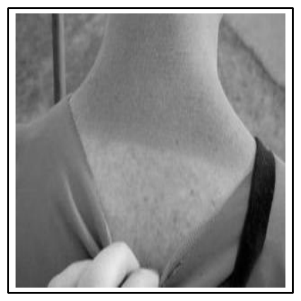
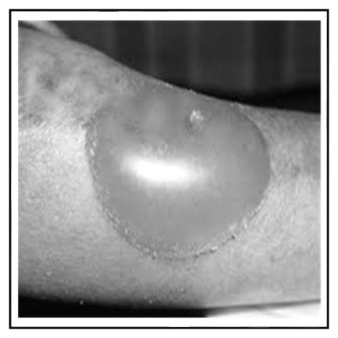
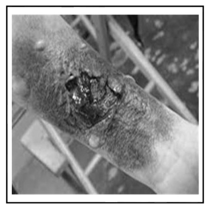
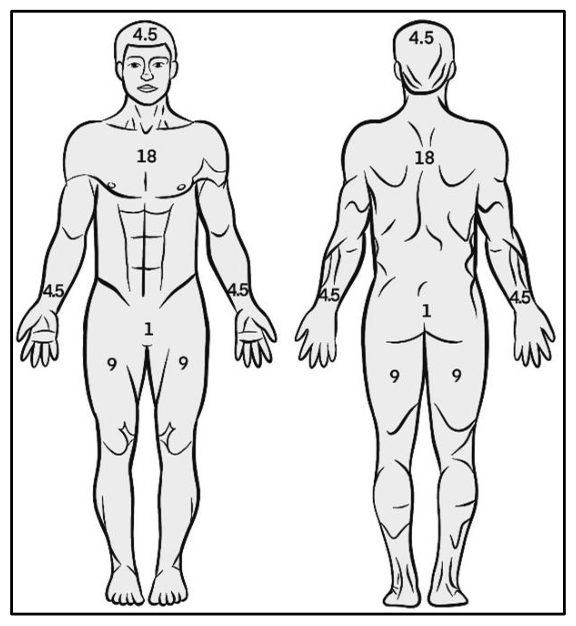

# 第 12 章　燒傷

> **來源**：ATP 4-02.11《陸軍傷患處置、戰術戰傷救護與急救技術準則》，2026 年 3 月 23 日版
> **對應原文**：Chapter 12 — Burns（印刷頁 115–120 / PDF 頁 129–134）
> **譯註**：本譯稿以繁體中文為主體，專有名詞首次出現時附上英文原文與縮寫。圖片位置以標註保留，影像於全書文字完成後統一處理；圖 12-4「九則律」的百分比數值已完整譯出於標註下方。

---

## 12.1　燒傷概論

**12-1.** 燒傷的創傷傷患，**應先依 MARCH-PAWS 序列處置所有其他危及生命的傷勢，之後才處理燒傷**。即使皮膚已燒傷，創傷處置仍可**在燒傷皮膚上或穿過燒傷皮膚**施行。

**12-2.** 燒傷可能有下列各種成因：

- **摩擦燒傷（friction burn）**。常見於皮膚被硬物表面磨掉的情況，例如交通事故中機車騎士、自行車騎士或滑板者在路面上滑行所造成的「**路面磨擦傷（road rash）**」。**地毯燒傷**源於皮膚在地毯上摩擦，常見於室內運動或玩耍時；**繩索燒傷**常見於攀登或拔河等活動；**滑行燒傷**則常發生在棒球等運動中滑壘時。
- **冷灼傷（cold burn）**。又稱**凍傷（frostbite）**，透過凍結來損傷皮膚。凍傷可能源於長時間暴露於冰點以下的溫度，或直接接觸極冷物體。
- **熱燒傷（thermal burn）**。發生於皮膚接觸到極熱的物體時，例如高溫金屬、滾燙液體、火焰或蒸氣，使皮膚溫度升高到足以殺死皮膚細胞。
- **輻射燒傷（radiation burn）**。曬傷是典型例子，其他來源包括 X 光或癌症的放射線治療。
- **化學灼傷（chemical burn）**。發生於強酸、溶劑或清潔劑接觸皮膚時。
- **電燒傷（electrical burn）**。因接觸電流而造成的燒傷。

**12-3.** 燒傷依其對皮膚的損傷**深度**分類：

- **淺層燒傷／一度燒傷**（superficial or first degree，見第 116 頁圖 12-1）：僅影響皮膚**最外層**，造成泛紅、疼痛與輕微腫脹。類似輕微曬傷，通常數天內癒合且**不留疤**。
- **部分厚度燒傷／二度燒傷**（partial thickness or second degree，見第 116 頁圖 12-2）：深達皮膚**第二層**，可能造成**水泡**、劇烈疼痛、泛紅與腫脹。癒合時間不一，**可能留疤**。
- **全厚度燒傷／三度燒傷**（full thickness or third degree，見第 116 頁圖 12-3）：**最為嚴重**，貫穿皮膚**全層**，可能損及下方的肌肉或骨骼。皮膚可能呈現**白色、發黑或焦炭狀**，且該區域因**神經受損而可能毫無感覺**。此類燒傷需要立即醫療處置，且常需**植皮**才能癒合。

<figure>
  
  <figcaption>圖 12-1．一度／淺層燒傷（原書 p.116） 原文圖說：Figure 12-1. First degree or Superficial burn</figcaption>
</figure>

<figure>
  
  <figcaption>圖 12-2．二度／部分厚度燒傷（原書 p.116） 原文圖說：Figure 12-2. Second degree or Partial thickness burn</figcaption>
</figure>

<figure>
  
  <figcaption>圖 12-3．三度／全厚度燒傷（原書 p.116） 原文圖說：Figure 12-3. Third degree or Full thickness burn</figcaption>
</figure>

**12-4.** 燒傷面積的大小或百分比，應記錄於 **DD Form 1380**。判定或估算燒傷百分比的方法是「**九則律（Rule of Nines）**」。圖 12-4 顯示身體各部位的概略比例：身體被劃分為若干區域，各佔全身體表面積的百分比如下：

| 身體部位 | 佔全身體表面積 |
|---|---|
| 頭部 | 9% |
| 軀幹（前側） | 18% |
| 軀幹（後側） | 18% |
| 手臂 | **各** 9% |
| 腿部 | **各** 18% |
| 陰部 | 1% |
| 臀部 | 1% |

<figure>
  
  <figcaption>圖 12-4．燒傷面積百分比「九則律」（原書 p.116） 原文圖說：Figure 12-4. Burn area percentage "Rule of Nines"</figcaption>
</figure>

> **註**：**一度（淺層）燒傷不列入燒傷百分比的計算**，且在醫療上鮮少具有意義。

> **譯註**：上表各項相加為 101%（標準九則律中，臀部通常已包含在「軀幹後側 18%」內）。譯文依原文照列，未作調整；實務估算時請以單位訓練規範為準。

**12-5.** 一般通則是：**傷患一個手掌的大小，約等於燒傷面積的 1%**。估算時最簡便的做法是**無條件進位到最接近的 10%**。若前側或後側區域燒傷了一半，該區域的數值就取一半。例如：若大腿前側或小腿前側燒傷了一半，即為 9% 的一半，也就是 **4.5%**；若軀幹前側燒傷了一半（無論是前側上半或下半），即為 18% 的一半，也就是 **9%**。請記住：**燒傷百分比越高，發生低體溫的機率也越高。**

---

## 12.2　燒傷處置所用裝備

**12-6.** CoTCCC 建議的**壓縮紗布**與捲軸紗布，是經過壓縮的**六層無菌棉質**紗布。用途包括：止住輕微出血、覆蓋傷口或燒傷、填塞傷口、作為加壓敷料的大體積墊材，或在固定夾板時墊在受壓點上。

**12-7.** CoTCCC 建議的**彈性繃帶**是可伸縮的繃帶，用於固定敷料或夾板，也可綁得較緊以對傷口施加局部壓力。**但彈性或束縛性繃帶通常不用於燒傷傷患**——施加這類繃帶會非常疼痛，且傷勢引起的續發性腫脹可能造成循環受阻。

**12-8.** **三角巾（cravat）** 是無菌的三角形繃帶，既可當繃帶也可當吊帶使用，常用於固定夾板、製作吊帶，或為受傷肢體製作束縛帶。

---

## 12.3　燒傷處置第一級（Tier 1）技能

**12-9.** TCCC 中的燒傷照護非常基本。**首要之務是消除燒傷來源。** 在把傷患移離燒傷來源、或撲滅燒傷成因之前就施行任何處置，不但無效，還會對傷患與傷患處置人員造成傷害。

**12-10.** **電燒傷**的照護包括——

1. 消除電燒傷的來源。
2. 關閉任何已使傷患暴露其中的電源（若適用）。
3. 若無法關閉電源，使用**非導電材料**將傷患拖離電源。

> **註**：非導電材料的種類包括**繩索、衣物與乾燥木材**。

4. 將傷患移至安全處。

> ### ⚠️ 警告（WARNING）
>
> **不可徒手碰觸傷患或電源，否則你也會受傷！**
>
> 來自電源或閃電的高壓電燒傷，可能造成暫時性意識喪失、呼吸困難，或心臟問題（心律不整）。

**12-11.** **熱燒傷**的照護包括——

1. 停止熱燒傷的來源，並將傷患移離燒傷來源。
2. 撲滅傷患身上的任何火焰，剪開燒傷區域周圍的衣物，並輕輕掀開。

> ### ⚠️ 注意（CAUTION）
>
> 若**衣物已黏附在燒傷處**，務必**沿著衣物周圍剪開，並將黏住的部分留在原處**。

3. 移動或抬起傷患時，避免抓握燒傷區域。

**12-12.** **化學灼傷**的照護包括——

1. 消除化學灼傷的來源。
2. 以乾淨的乾布**小心刷除**乾燥的化學物質。
3. 以**大量流動清水沖洗**燒傷區域，去除任何液態化學物質。
4. 施加**濕潤屏障**（浸水的紗布、衣物或泥土）搭配密封敷料。
5. **立即通報**醫療人員。

> ### ⚠️ 警告（WARNING）
>
> **不可將化學灼傷的傷患浸入水中。** 這會大幅助長低體溫，並使刺激範圍擴散。

**12-13.** **所有燒傷**的照護都包括——

1. 監測傷患是否出現危及生命的狀況。
2. 檢查是否有其他傷勢。
3. 依休克處置（若適用）。
4. 尋求醫療協助。
5. 將所有處置與照護記載於 **DD Form 1380**。

**12-14.** 必須**密切注意傷患的呼吸道與呼吸**，並**一律評估**是否有二次傷勢與休克。

---

## 12.4　燒傷處置第二級（Tier 2）技能

**12-15.** 除了第 12-9 至 12-14 段所述的處置措施外，還應**特別著重防止體熱散失的方法**。**燒傷傷患特別容易發生低體溫**，應儘速使其離開地面，並置於具隔熱效果的表面上。

> **譯註**：原文此處誤植為「paragraph 13-9 through 13-14」（第 13 章），但依上下文應為本章第 12-9 至 12-14 段。譯文已依實際內容更正段號，特此說明。

**12-16.** 對於**大範圍燒傷**（燒傷面積超過 **20%**）的傷患，應將其置入**反射熱護罩（Heat Reflective Shield）** 內，以覆蓋燒傷區域並預防低體溫。**燒傷傷患的低體溫預防與處置至關重要，且無論環境溫度高低都必須進行。**

**12-17.** **顏面燒傷**——尤其是發生在**密閉空間**中的顏面燒傷——可能伴隨**吸入性傷害（inhalation injury）**。這類傷患應密切監測是否出現呼吸道問題。**有吸入性燒傷徵象的傷患，不可置入 NPA。** 若懷疑吸入性傷害，應儘速通報醫療人員。

**12-18.** 可施予**止痛（analgesia）** 以處置燒傷疼痛。**抗生素治療並非單為燒傷而使用**，它同時也用於預防穿刺傷的感染。若自受傷時起算，醫療處置需超過**三小時**才能取得，且給藥不會使傷患噁心，應考慮給予整包戰傷用藥包。

**12-19.** 應同時考量**溫暖天候與寒冷天候**下的介入措施。**加上失血的因素，即使外界天氣炎熱，體溫仍可能下降。止血帶不可被覆蓋——要讓它保持可見，好讓醫療人員一眼就能看到。**

---

## 12.5　燒傷處置的應急技能

**12-20.** 在緊急情境中——尤其是偏遠地區或戰鬥區——以有限資源有效處置燒傷至關重要。**紗布繃帶、乾淨衣物與三角巾**等基本材料，都可用來覆蓋燒傷並控制出血。燒傷的**冷卻與清潔**應使用手邊可得的乾淨清水，**避免使用冰塊**，以免造成皮膚進一步損傷。遇到**熱燒傷**，關鍵是將傷患移離熱源，並輕輕剪除燒傷區域周圍的衣物；遇到**電燒傷**，切斷電源並以非導電材料移動傷患至為關鍵；遇到**化學灼傷**，則需立即除污——刷除乾燥化學物質，並以清水徹底沖洗該區域。

**12-21.** 由於皮膚受損帶來高風險，**預防低體溫在燒傷照護中至關重要**。使用急救毯、反射熱護罩，或以天然材料自製的隔熱物，都有助於維持體溫。疼痛控制在可行時，應包含安全地投予非處方止痛藥；**持續監測是否出現休克**同樣不可或缺。這些野戰應急技術是穩定燒傷傷者、防止進一步傷害的關鍵，直到能取得更進階的醫療協助為止——這也凸顯了此類緊急介入中訓練與整備的重要性。

---

## 附錄　本章新增術語對照表

> 沿用第 4–11 章術語表，以下為本章新增條目。

| 英文 / 縮寫 | 繁體中文譯法 | 備註 |
|---|---|---|
| friction burn | 摩擦燒傷 | 含 road rash、地毯、繩索、滑行燒傷 |
| cold burn / frostbite | 冷灼傷 / 凍傷 | |
| thermal burn | 熱燒傷 | |
| radiation burn | 輻射燒傷 | 曬傷、X 光、放射治療 |
| chemical burn | 化學灼傷 | **不可浸水** |
| electrical burn | 電燒傷 | 不可徒手接觸 |
| superficial / first degree burn | 淺層 / 一度燒傷 | 不列入燒傷百分比計算 |
| partial thickness / second degree burn | 部分厚度 / 二度燒傷 | 起水泡 |
| full thickness / third degree burn | 全厚度 / 三度燒傷 | 可能無痛覺，常需植皮 |
| Rule of Nines | 九則律 | 燒傷面積估算法 |
| total body surface area (TBSA) | 全身體表面積 | 手掌約 1% |
| skin graft | 植皮 | |
| compressed gauze | 壓縮紗布 | 六層無菌棉質 |
| 6-ply | 六層 | |
| occlusive dressing | 密封敷料 | |
| Heat Reflective Shield | 反射熱護罩 | 燒傷超過 20% 時使用 |
| inhalation injury | 吸入性傷害 | **有此徵象者禁用 NPA** |
| analgesia | 止痛 | |
| over-the-counter pain reliever | 非處方止痛藥 | |
| nonconductive material | 非導電材料 | 繩索、衣物、乾木 |
| ambient temperature | 環境溫度 | |
| pubic area / buttocks | 陰部 / 臀部 | 九則律各佔 1% |

---

*本章譯稿完成，段落 12-1 至 12-21。原文含圖 12-1 至 12-4 共 4 張，其中圖 12-4 的九則律數值已完整譯出。*
